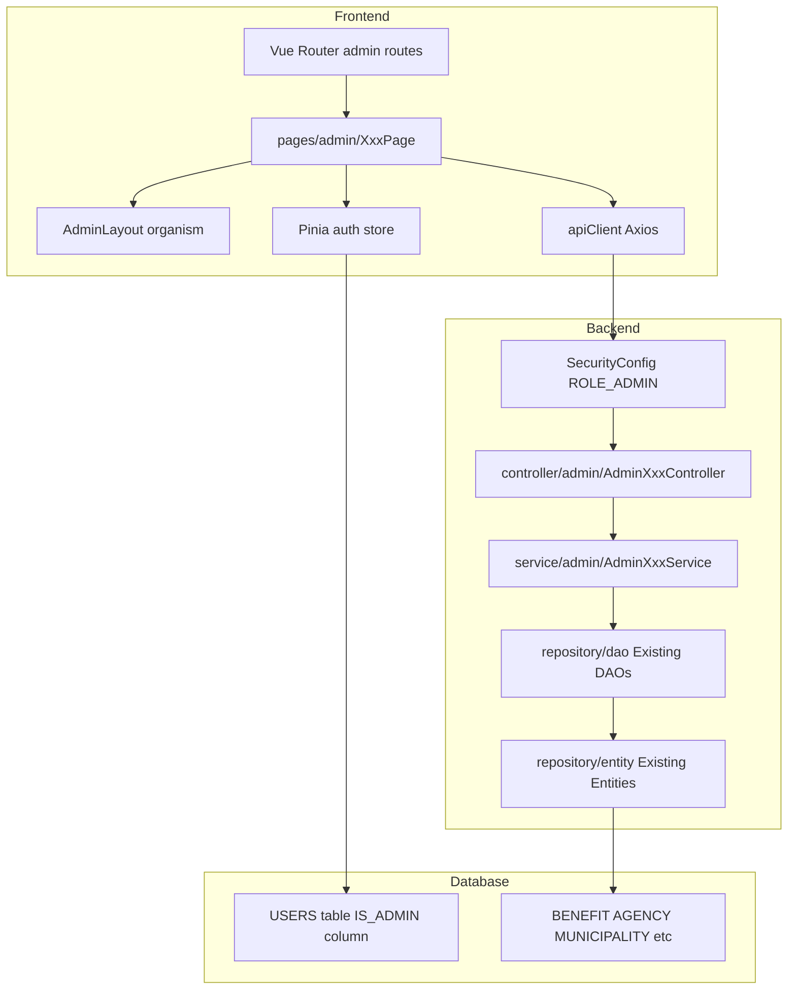
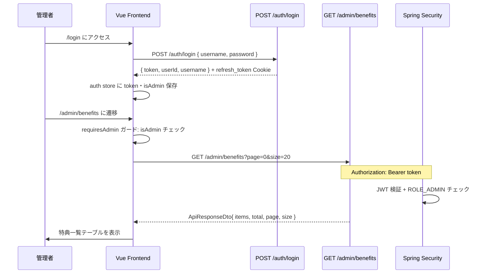

# 技術設計書: admin-crud

## Overview

本機能は、熊本県自主返納特典マップの管理者が Web ブラウザから全マスターデータを CRUD 操作できる管理者画面を実装する。対象テーブルは BENEFIT・BENEFIT_ELIGIBILITY・BENEFIT_CATEGORY・MUNICIPALITY・AGENCY・FARE_DISCOUNT・COMMUNITY_BUS・USERS の 8 テーブル。既存エンドユーザー向け画面・API への変更を伴わず、`/admin/**` エンドポイントと `/admin/*` ルートを追加する純粋な拡張設計とする。

**Users**: 管理者（IS_ADMIN = '1' のユーザー）が管理画面にログインし、マスターデータの登録・更新・削除・参照を行う。

### Goals

- 全対象テーブルに対するページング付き一覧・登録・更新・削除を実現する
- 既存の JWT / Spring Security / Vue Router パターンを踏襲し、最小変更で管理者ロールを追加する
- 既存 Atom コンポーネント（`AppDialog`, `AppPaginator`, `AppBlockUI`, `AppToastMessage`）を管理画面に再利用する

### Non-Goals

- REFRESH_TOKENS / PASSWORD_RESET_TOKENS テーブルの画面管理（システム管理テーブル）
- 既存エンドユーザー向け API・画面への変更
- バッチ処理・CSV インポート/エクスポート（今フェーズ外）

---

## Boundary Commitments

### This Spec Owns

- `/admin/**` REST エンドポイントの定義・実装（controller/admin/）
- 管理者ロール（ROLE_ADMIN）の認証・認可制御（SecurityConfig 拡張）
- USERS テーブルへの IS_ADMIN カラム追加（DDL・DML・Entity 同時更新）
- `/admin/*` フロントエンドルートおよび管理者専用ページ（pages/admin/）
- 管理画面用 TypeScript DTO 型定義（dto/admin/）

### Out of Boundary

- エンドユーザー向けエンドポイント（`/benefit/**`, `/users/**`, `/auth/**` など）の変更
- 既存 BenefitService / UsersService など、既存サービスへのロジック追加
- 管理者向けメール通知・監査ログ機能（将来フェーズ）

### Allowed Dependencies

- 既存 DAO 群（`BenefitDao`, `BenefitCategoryDao`, `AgencyDao`, `BenefitEligibilityDao`, `FareDiscountDao`, `CommunityBusDao`, `MunicipalityDao`, `UsersDao`）
- 既存 Entity 群（`BenefitEntity`, `BenefitCategoryEntity` など）
- 既存 `ApiResponseDto<T>` 共通レスポンス形式
- 既存フロントエンド Atom コンポーネント・`apiClient`・`useAuthStore`

### Revalidation Triggers

- USERS テーブルの IS_ADMIN カラム追加 → `CustomUserDetails` の getAuthorities() 変更 → 既存認証フローの再テストが必要
- SecurityConfig の変更 → 既存 permitAll / authenticated エンドポイントへの影響テストが必要
- 管理者 API レスポンス形式の変更 → 管理画面フロントエンドの再確認が必要

---

## Architecture

### Existing Architecture Analysis

既存システムはモノレポ構成（`apps/front/` + `apps/back/`）で、以下のパターンが確立している:

- **バックエンド**: Controller → Service → DAO（Doma 2 Entityql）→ Entity の 4 層。例外は `try-catch` + `ApiResponseDto` で統一
- **フロントエンド**: Atomic Design（atoms/molecules/organisms/pages）+ Pinia ストア + Vue Router ルートガード
- **認証**: STATELESS JWT（`Authorization: Bearer`）。`CustomUserDetails` は現在 `ROLE_USER` を固定返却

重要制約：`CustomUserDetails.getAuthorities()` が `ROLE_USER` をハードコードしているため、ROLE_ADMIN 付与には USERS テーブルと Entity の変更が必要（詳細は `research.md` 参照）。

### Architecture Pattern & Boundary Map



**Architecture Integration**:
- 選定パターン: 既存レイヤードアーキテクチャへの admin サブパッケージ追加
- ドメイン境界: `controller/admin/`, `service/admin/` を追加。既存 controller/service には手を加えない
- 新コンポーネントの根拠: エンドユーザー向けと管理者向けを同一クラスに混在させると権限制御が複雑化するため分離
- Steering 準拠: 既存 `BenefitController + BenefitService` パターンを admin 配下に踏襲

### Technology Stack

| Layer | Choice / Version | Role | Notes |
|-------|-----------------|------|-------|
| Frontend | Vue 3 + TypeScript 5 | 管理画面 UI | `<script setup>` + Composition API |
| State | Pinia | 認証状態・isAdmin 判定 | 既存 auth store を拡張 |
| UI Components | PrimeVue 4 + 既存 Atoms | DataTable・Dialog・Paginator | `AppDataTable.vue` を atoms に新規追加 |
| HTTP | Axios (apiClient) | /admin/** API 呼び出し | Bearer Token インターセプター流用 |
| Backend | Spring Boot 3.3.5 + Java 21 | Admin REST API | STATELESS JWT |
| Authorization | Spring Security `hasRole('ADMIN')` | /admin/** アクセス制御 | SecurityConfig 拡張 |
| ORM | Doma 2 Entityql | 既存 DAO 再利用 | limit/offset でページネーション |
| Database | PostgreSQL | USERS + マスターテーブル | IS_ADMIN カラム追加のみ変更 |

---

## File Structure Plan

### Directory Structure

```
apps/back/src/main/java/.../
├── controller/admin/                     # 管理者向けエンドポイント（エンティティ単位で分割）
│   ├── AdminBenefitController.java
│   ├── AdminBenefitCategoryController.java
│   ├── AdminBenefitEligibilityController.java
│   ├── AdminAgencyController.java
│   ├── AdminMunicipalityController.java
│   ├── AdminFareDiscountController.java
│   ├── AdminCommunityBusController.java
│   └── AdminUsersController.java
├── service/admin/                        # 管理者向けビジネスロジック（controller と 1:1 対応）
│   ├── AdminBenefitService.java
│   ├── AdminBenefitCategoryService.java
│   ├── AdminBenefitEligibilityService.java
│   ├── AdminAgencyService.java
│   ├── AdminMunicipalityService.java
│   ├── AdminFareDiscountService.java
│   ├── AdminCommunityBusService.java
│   └── AdminUsersService.java
├── dto/admin/
│   └── AdminPagedResponseDto.java        # 共通ページングレスポンス { items, total, page, size }
└── (既存 DAO/Entity はそのまま使用)

config/database/DDL/TABLE/
└── USERS.SQL                             # IS_ADMIN カラム追加

config/database/DML/TABLE/
└── USERS.SQL                             # 管理者シードデータ追加
```

```
apps/front/src/
├── pages/admin/                          # 管理者画面ページ（テーブル単位）
│   ├── AdminBenefitPage.vue
│   ├── AdminBenefitCategoryPage.vue
│   ├── AdminBenefitEligibilityPage.vue
│   ├── AdminAgencyPage.vue
│   ├── AdminMunicipalityPage.vue
│   ├── AdminFareDiscountPage.vue
│   ├── AdminCommunityBusPage.vue
│   └── AdminUsersPage.vue
├── components/
│   ├── atoms/
│   │   └── AppDataTable.vue              # PrimeVue DataTable の薄いラッパー（新規追加）
│   └── organisms/
│       └── AdminSidebar.vue              # 管理画面ナビゲーションサイドバー（新規追加）
├── layouts/
│   └── AdminLayout.vue                   # 管理者レイアウト（サイドバー + コンテンツ）
├── dto/admin/
│   └── adminDto.ts                       # 管理画面用 TypeScript 型定義（全エンティティ）
```

### Modified Files

- `apps/back/.../config/SecurityConfig.java` — `/admin/**` に `hasRole('ADMIN')` 追加
- `apps/back/.../security/CustomUserDetails.java` — `isAdmin == "1"` 時に `ROLE_ADMIN` を返すよう変更
- `apps/back/.../repository/entity/UsersEntity.java` — `isAdmin` フィールド追加
- `apps/front/src/router/index.ts` — `/admin/*` ルート群を追加（`meta: { requiresAdmin: true }`）
- `apps/front/src/stores/auth.ts` — `isAdmin` ゲッターを追加

---

## System Flows

### 管理者ログイン〜画面アクセスフロー



---

## Requirements Traceability

| 要件 | Summary | Components | Interfaces | Flows |
|------|---------|------------|------------|-------|
| 1.1–1.6 | 管理者認証・アクセス制御 | SecurityConfig, CustomUserDetails, UsersEntity, auth store | SecurityConfig.filterChain, CustomUserDetails.getAuthorities | Login→Admin フロー |
| 2.1–2.9 | 特典管理 CRUD | AdminBenefitController, AdminBenefitService | GET/POST/PUT/DELETE /admin/benefits | — |
| 3.1–3.6 | 特典条件管理 CRUD | AdminBenefitEligibilityController, AdminBenefitEligibilityService | GET/POST/PUT/DELETE /admin/benefit-eligibilities | — |
| 4.1–4.6 | カテゴリ管理 CRUD | AdminBenefitCategoryController, AdminBenefitCategoryService | GET/POST/PUT/DELETE /admin/benefit-categories | — |
| 5.1–5.5 | 自治体管理 CRUD | AdminMunicipalityController, AdminMunicipalityService | GET/POST/PUT/DELETE /admin/municipalities | — |
| 6.1–6.4 | 事業者管理 CRUD | AdminAgencyController, AdminAgencyService | GET/POST/PUT/DELETE /admin/agencies | — |
| 7.1–7.5 | 運賃割引管理 CRUD | AdminFareDiscountController, AdminFareDiscountService | GET/POST/PUT/DELETE /admin/fare-discounts | — |
| 8.1–8.5 | コミュニティバス路線管理 CRUD | AdminCommunityBusController, AdminCommunityBusService | GET/POST/PUT/DELETE /admin/community-buses | — |
| 9.1–9.7 | ユーザー管理 | AdminUsersController, AdminUsersService | GET/PUT/DELETE /admin/users | — |
| 10.1–10.6 | 共通 UI/UX | AdminLayout, AdminSidebar, AppDataTable, AppPaginator | — | — |

---

## Components and Interfaces

### コンポーネントサマリー

| Component | Layer | Intent | Req Coverage | Key Dependencies | Contracts |
|-----------|-------|--------|--------------|-----------------|-----------|
| SecurityConfig（変更） | Backend/Security | /admin/** を ROLE_ADMIN で保護 | 1.1–1.3 | JwtAuthenticationFilter | API |
| CustomUserDetails（変更） | Backend/Security | isAdmin に応じた Authority 返却 | 1.1, 1.6 | UsersEntity | Service |
| AdminXxxController × 8 | Backend/Controller | エンティティ別 CRUD エンドポイント | 2–9 | AdminXxxService, ApiResponseDto | API |
| AdminXxxService × 8 | Backend/Service | CRUD ビジネスロジック・外部キー制約チェック | 2–9 | 既存 DAO 群 | Service |
| AdminPagedResponseDto | Backend/DTO | 共通ページングレスポンス | 2.1, 10.4 | — | — |
| AdminLayout | Frontend/Layout | 管理者レイアウト（サイドバー + コンテンツ） | 10.5 | AdminSidebar, router-view | State |
| AdminXxxPage × 8 | Frontend/Page | 各テーブルの一覧・検索・登録・編集・削除画面 | 2–9 | apiClient, AppDataTable, AppDialog | State |
| AppDataTable | Frontend/Atom | PrimeVue DataTable ラッパー | 10.4, 10.5 | PrimeVue DataTable | — |
| auth store（変更） | Frontend/Store | isAdmin ゲッター追加 | 1.1, 1.4 | Pinia | State |

---

### Backend / Security

#### SecurityConfig（変更）

| Field | Detail |
|-------|--------|
| Intent | `/admin/**` エンドポイントに `ROLE_ADMIN` 認可ルールを追加する |
| Requirements | 1.1, 1.2, 1.3 |

**Responsibilities & Constraints**
- 既存の `permitAll` / `authenticated` ルールより前に `/admin/**` の `hasRole('ADMIN')` ルールを配置する
- 既存エンドポイントへの影響ゼロを保証する

**Contracts**: API [x]

##### API Contract（認可ルール）

| Path Pattern | Required Role | Notes |
|-------------|---------------|-------|
| `/admin/**` | `ROLE_ADMIN` | 未認可は 403 を `ApiResponseDto.error` 形式で返す |
| 既存パターン | 変更なし | 順序を確保するため既存ルールの前に追加 |

**Implementation Notes**
- Integration: `filterChain` メソッド内の `authorizeHttpRequests` に `.requestMatchers("/admin/**").hasRole("ADMIN")` を既存ルールの先頭近くに追加
- Validation: `/admin/**` ルール追加後、既存エンドユーザー向け API の疎通テストを実施すること
- Risks: ルール順序を誤ると既存エンドポイントが 403 になるリスク

---

#### CustomUserDetails（変更）

| Field | Detail |
|-------|--------|
| Intent | `UsersEntity.isAdmin` フィールドに基づき `ROLE_ADMIN` または `ROLE_USER` を返す |
| Requirements | 1.1, 1.6 |

**Responsibilities & Constraints**
- `isAdmin == "1"` のとき `ROLE_ADMIN` を返す。`ROLE_USER` との重複付与は不要
- `UsersEntity` への依存のみ（追加依存なし）

**Contracts**: Service [x]

##### Service Interface

```java
@Override
public Collection<? extends GrantedAuthority> getAuthorities() {
    String role = "1".equals(user.getIsAdmin()) ? "ROLE_ADMIN" : "ROLE_USER";
    return List.of(new SimpleGrantedAuthority(role));
}
```

- Preconditions: `UsersEntity.isAdmin` が non-null（DDL DEFAULT '0' で保証）
- Postconditions: 常に 1 件の GrantedAuthority を返す

---

### Backend / Controller・Service（共通パターン）

8 エンティティ（Benefit, BenefitCategory, BenefitEligibility, Agency, Municipality, FareDiscount, CommunityBus, Users）は同一パターンに従う。以下は代表として `AdminBenefitController` / `AdminBenefitService` を示す。他のエンティティは同パターンを適用する。

#### AdminBenefitController

| Field | Detail |
|-------|--------|
| Intent | BENEFIT テーブルの管理者向け CRUD エンドポイント |
| Requirements | 2.1–2.9 |

**Responsibilities & Constraints**
- `@RequestMapping("/admin/benefits")` でエンドポイントをマッピング
- すべての例外を `try-catch` で捕捉し `ApiResponseDto.error` を返す
- ビジネスロジックは `AdminBenefitService` に委譲する

**Dependencies**
- Outbound: `AdminBenefitService` — CRUD ロジック (P0)

**Contracts**: API [x]

##### API Contract（全エンティティ共通パターン）

| Method | Endpoint | Request | Response | Errors |
|--------|----------|---------|----------|--------|
| GET | `/admin/benefits` | `?page=0&size=20&municipalityCd=&categoryCd=` | `ApiResponseDto<AdminPagedResponseDto<BenefitEntity>>` | 401, 403, 500 |
| POST | `/admin/benefits` | `BenefitEntity` (JSON) | `ApiResponseDto<BenefitEntity>` | 400, 409, 401, 403, 500 |
| PUT | `/admin/benefits/{benefitId}` | `BenefitEntity` (JSON) | `ApiResponseDto<BenefitEntity>` | 400, 404, 401, 403, 500 |
| DELETE | `/admin/benefits/{benefitId}` | — | `ApiResponseDto<Void>` | 404, 409, 401, 403, 500 |

他エンティティのエンドポイントは同パターンで以下のベースパスに従う:

| エンティティ | ベースパス | PKパターン |
|------------|-----------|----------|
| BenefitCategory | `/admin/benefit-categories` | `{categoryCd}` |
| BenefitEligibility | `/admin/benefit-eligibilities` | `{id}` (BIGSERIAL) |
| Agency | `/admin/agencies` | `{agencyId}` |
| Municipality | `/admin/municipalities` | `{municipalityCd}` |
| FareDiscount | `/admin/fare-discounts` | `{benefitId}/{agencyId}` (複合PK) |
| CommunityBus | `/admin/community-buses` | `{routeId}` |
| Users | `/admin/users` | `{userId}` |

> Users エンドポイントは POST（新規作成）を提供しない（ユーザーはセルフ登録のみ）

**Implementation Notes**
- Integration: `@Tag(name = "管理者")` で Swagger グループ化
- Validation: `@RequestBody` の必須フィールドは Bean Validation（`@NotBlank` 等）でバリデーション
- Risks: FareDiscount の複合 PK 削除では Entity に benefitId + agencyId をセットして DAO の `@Delete` を呼ぶこと

---

#### AdminBenefitService（代表）

| Field | Detail |
|-------|--------|
| Intent | BENEFIT テーブルの CRUD ビジネスロジック。外部キー制約チェックを含む |
| Requirements | 2.1–2.9 |

**Dependencies**
- Outbound: `BenefitDao` — CRUD 操作 (P0)
- Outbound: `BenefitEligibilityDao` — 削除前の依存チェック (P1)
- Outbound: `FareDiscountDao` — 削除前の依存チェック (P1)

**Contracts**: Service [x]

##### Service Interface

```java
public interface AdminBenefitServiceContract {
    AdminPagedResponseDto<BenefitEntity> getAll(int page, int size, String municipalityCd, String categoryCd);
    BenefitEntity create(BenefitEntity entity);
    BenefitEntity update(String benefitId, BenefitEntity entity);
    void delete(String benefitId);  // 依存レコード存在時は RuntimeException をスロー
}
```

- Preconditions: `delete` 呼び出し前に BenefitEligibility・FareDiscount の存在チェックを行う
- Postconditions: 登録・更新時に `SYS_CREATED_AT` / `SYS_UPDATED_AT` を自動セット
- Invariants: 存在しない `benefitId` への更新・削除は `RuntimeException` をスロー（Controller が 404 を返す）

**Implementation Notes**
- Integration: 依存チェックで関連レコードが存在する場合は連動削除 or エラーの挙動を実装時に選択すること（要件 2.9 参照）
- Validation: `SYS_CREATED_AT` は登録時のみセット、`SYS_UPDATED_AT` は登録・更新の両方でセット
- Risks: Doma 2 の `@Delete` は楽観的ロック（`@Version` 非使用）のため、更新時のバージョン確認は行わない

---

#### AdminPagedResponseDto

```java
public class AdminPagedResponseDto<T> implements Serializable {
    @Serial private static final long serialVersionUID = 1L;
    private final List<T> items;
    private final long total;
    private final int page;
    private final int size;

    public static <T> AdminPagedResponseDto<T> of(List<T> items, long total, int page, int size) { ... }
}
```

---

### Frontend / Store

#### auth store（変更）

| Field | Detail |
|-------|--------|
| Intent | ログイン済みユーザーの `isAdmin` 状態をフロントエンドに公開する |
| Requirements | 1.1, 1.4 |

**Contracts**: State [x]

##### State Management

ログインレスポンスに `isAdmin: boolean` を含め、Pinia state に格納する。

```typescript
interface AuthState {
  token: string | null
  user: { id: number; username: string; isAdmin: boolean } | null
}

// getter
const isAdmin = computed<boolean>(() => state.user?.isAdmin ?? false)
```

> バックエンドの `/auth/login` レスポンスに `isAdmin` フィールドを追加する（`LoginResponseDto` 拡張）

**Implementation Notes**
- Integration: ルートガードで `auth.isAdmin` を参照し、false の場合は `/` にリダイレクト
- Risks: `isAdmin` がメモリ（Pinia state）のみで保持されるため、ページリロード時は `restoreSession()` で再取得が必要

---

### Frontend / Page（共通パターン）

8 管理画面ページは同一パターンに従う。各ページは独立した責務を持ち、以下の構成をとる。

#### AdminXxxPage（パターン説明）

| Field | Detail |
|-------|--------|
| Intent | 対応テーブルのページング一覧・検索・登録フォーム（AppDialog）・編集・削除確認ダイアログを提供 |
| Requirements | 各テーブル対応要件、10.1–10.6 |

**Responsibilities & Constraints**
- `onMounted` で一覧 API を呼び出し、`AppDataTable` に渡す
- `AppDialog` を使って登録・編集フォームを表示し、保存時に POST / PUT API を呼ぶ
- 削除時は `AppDialog`（確認）を表示し、確認後に DELETE API を呼ぶ
- API 成功時: `AppToastMessage` でトースト通知
- API 呼び出し中: `AppBlockUI` でオーバーレイ表示、`isLoading` フラグで二重送信防止

**Contracts**: State [x]

##### State Management（ページ内ローカル状態）

```typescript
// 各管理ページに共通するローカル状態パターン
const items = ref<XxxAdminDto[]>([])
const total = ref<number>(0)
const page = ref<number>(0)
const size = ref<number>(20)
const isLoading = ref<boolean>(false)
const isDialogVisible = ref<boolean>(false)
const isDeleteDialogVisible = ref<boolean>(false)
const editTarget = ref<XxxAdminDto | null>(null)
```

**Implementation Notes**
- Integration: `apiClient.get('/admin/xxx', { params: { page, size, ...filters } })` でデータ取得
- Validation: フォーム必須項目は送信前にクライアントサイドバリデーションを実施し、サーバーエラーは `AppMessageBar` で表示
- Risks: フォームの `v-model` バインディングで `editTarget` を直接変更すると一覧が影響を受けるため、編集時は `{ ...editTarget.value }` でシャローコピーして編集用オブジェクトを作成すること

---

### Frontend / Component

#### AppDataTable（新規 Atom）

| Field | Detail |
|-------|--------|
| Intent | PrimeVue `DataTable` を薄くラップし、プロジェクト統一の props インターフェースで利用できるようにする |
| Requirements | 10.4, 10.5 |

**Contracts**: Service [ ] / API [ ] / Event [ ] / Batch [ ] / State [ ]

```typescript
interface AppDataTableProps {
  value: Record<string, unknown>[]       // 表示するデータ配列
  columns: AppDataTableColumn[]          // カラム定義
  loading?: boolean                      // ローディング状態
  totalRecords?: number                  // 総レコード数（ページネーション用）
  rows?: number                          // 1ページあたりの行数
  first?: number                         // 先頭インデックス
}

interface AppDataTableColumn {
  field: string                          // データのキー名
  header: string                         // 表示ヘッダー名
  sortable?: boolean
}
```

**Implementation Notes**
- Integration: atoms 層のため PrimeVue DataTable のみに依存する。ビジネスロジックは持たない
- Risks: PrimeVue DataTable は slots で柔軟なカスタマイズが可能だが、Atom として過度なカスタマイズを受け付けないようにする

---

## Data Models

### Domain Model

- **USERS（変更）**: `IS_ADMIN CHAR(1)` を追加することで管理者と一般ユーザーを区別する集約
- **BENEFIT（既存）**: `MUNICIPALITY` と `BENEFIT_CATEGORY` への FK を持つメインエンティティ。削除時は `BENEFIT_ELIGIBILITY`・`FARE_DISCOUNT` の依存を事前チェック
- **マスターテーブル群（既存）**: `MUNICIPALITY`, `BENEFIT_CATEGORY`, `AGENCY` は FK の参照先。削除時は依存エンティティをチェックする

### Logical Data Model

#### USERS テーブル変更

| カラム名 | 型 | 変更 |
|--------|-----|------|
| IS_ADMIN | CHAR(1) | 新規追加。DEFAULT '0' NOT NULL |

```sql
-- DDL 変更
ALTER TABLE USERS ADD COLUMN IS_ADMIN CHAR(1) DEFAULT '0' NOT NULL;
COMMENT ON COLUMN USERS.IS_ADMIN IS '管理者フラグ（1:管理者,0:一般ユーザー）';
```

**Consistency & Integrity**: DDL 変更と同時に `UsersEntity.java`（`isAdmin` フィールド追加）と `CustomUserDetails.getAuthorities()` を変更すること（steering ルール）

### Data Contracts & Integration

**共通ページングレスポンス**

```typescript
// TypeScript（フロント）
interface AdminPagedResponse<T> {
  items: T[]
  total: number
  page: number
  size: number
}

// フロントエンドの管理画面用 DTO 例（Benefit）
interface BenefitAdminDto {
  benefitId: string
  municipalityCd: string
  categoryCd: string
  benefitName: string | null
  benefitShortName: string | null
  benefitDetail: string | null
  expDetail: string | null
  phoneNumber: string | null
  benefitUrl: string | null
  sysCreatedAt: string | null
  sysUpdatedAt: string | null
}
```

他エンティティの DTO は同パターンで `adminDto.ts` に定義する。詳細フィールドは DDL 定義（`research.md` 参照）に対応させること。

**LoginResponseDto 拡張（要件 1.4 対応）**

```java
// 既存 LoginResponseDto に isAdmin を追加
public class LoginResponseDto {
    private String token;
    private Long userId;
    private String username;
    private boolean isAdmin;   // 追加
}
```

---

## Error Handling

### Error Strategy

- **バックエンド**: 全 Admin Controller で `try-catch` を実施し、`ApiResponseDto.error(message)` を返す（既存パターン）
- **フロントエンド**: API エラーは `AppMessageBar` で表示。操作成功は `AppToastMessage` でトースト通知

### Error Categories and Responses

| カテゴリ | HTTPステータス | フロントエンド表示 |
|---------|--------------|----------------|
| 未認証（JWT 不正・期限切れ） | 401 | 既存 unauthorizedHandler でログイン画面リダイレクト |
| 権限不足（ROLE_ADMIN なし） | 403 | `AppMessageBar` でアクセス権限エラー表示 |
| 入力バリデーションエラー | 400 | `AppMessageBar` にサーバーエラーメッセージ表示 |
| リソース重複（一意制約違反） | 409 | `AppMessageBar` に重複エラーメッセージ表示 |
| 外部キー制約違反（削除不可） | 409 | `AppMessageBar` に依存エラーメッセージ表示 |
| リソース未存在 | 404 | `AppMessageBar` にリソース未存在エラー表示 |
| サーバー内部エラー | 500 | `AppMessageBar` に汎用エラーメッセージ表示 |

### Monitoring

- バックエンドの Admin Controller は各 catch ブロックで `log.error` を出力すること（既存パターンに合わせる）

---

## Testing Strategy

### Unit Tests（バックエンド）

- `AdminBenefitService`: getAll（フィルター条件）, create（重複 ID エラー）, delete（依存レコードあり/なし）
- `AdminBenefitCategoryService`: delete（BENEFIT 依存チェック）
- `CustomUserDetails.getAuthorities()`: isAdmin="1" / "0" それぞれの Authority 返却

### Integration Tests（バックエンド）

- `POST /admin/benefits`→ 201 Created（ROLE_ADMIN）
- `DELETE /admin/benefits/{id}`→ 409 Conflict（依存レコードあり）
- `GET /admin/users`→ 403 Forbidden（ROLE_USER でアクセス）
- `GET /admin/benefits`→ 200 OK（ページング動作確認）

### E2E / UI Tests（Playwright）

- 管理者ログイン → `/admin/benefits` 表示 → 特典登録 → 登録成功トースト確認
- 削除確認ダイアログ表示 → キャンセル → データ削除されないことを確認
- 一般ユーザーで `/admin/benefits` にアクセス → リダイレクトされることを確認
- ページネーション操作 → 2 ページ目のデータが表示されることを確認

---

## Security Considerations

- **管理者 URL の保護**: Spring Security でサーバーサイド（`hasRole('ADMIN')`）とフロントエンド（ルートガード）の二重チェックを実施
- **パスワードハッシュの非公開**: `AdminUsersController` の GET / PUT レスポンスには `PASSWORD_HASH` を含めない（`UserResponseDto` を流用するか、管理者用 DTO で除外する）
- **IS_ADMIN の自己変更防止**: `AdminUsersController.update()` で `isAdmin` フィールドの更新を受け付けないようにする（管理者権限付与は DB 直接操作のみ）
- **監査**: 将来的に管理者操作ログ（誰が何をいつ変更したか）の記録を検討すること（今フェーズ外）
