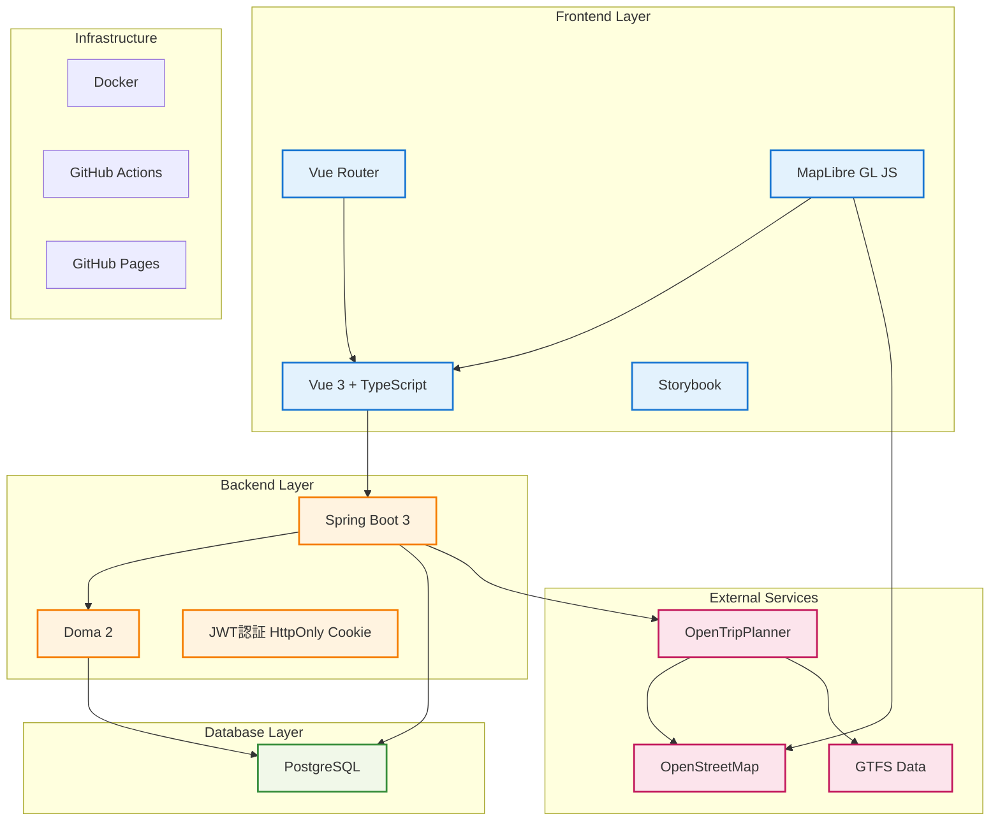

# 技術スタック

本システムで採用している技術スタックの詳細仕様と選定理由を説明します。

## アーキテクチャ概要

## フロントエンド技術スタック

### Vue.js 3

**バージョン**: 3.x

**選定理由**:
- 学習コストが低く、開発効率が高い
- TypeScriptとの親和性が良い
- Composition APIによる再利用性の高いコンポーネント設計
- 豊富なエコシステムと活発なコミュニティ

**主要機能**:
- リアクティブなデータバインディング
- コンポーネントベース開発
- 仮想DOM による高速レンダリング

### TypeScript

**バージョン**: 5.x

**選定理由**:
- 静的型チェックによる品質向上
- IDEサポートの充実
- 大規模開発での保守性向上
- Javaとの型システム親和性

**設定**:
- 厳格モード有効
- ES2022ターゲット
- モジュール解決: Node.js

### Vue Router

**バージョン**: 4.x

**機能**:
- SPA用ルーティング
- 動的ルート生成
- ナビゲーションガード
- 履歴管理

### 地図ライブラリ

**MapLibre GL JS**

**バージョン**: 5.6.0

**選定理由**:
- 軽量で高性能なベクトル地図表示
- WebGL による高速レンダリング
- モバイル対応
- オープンソース
- カスタマイズ性の高いスタイリング

### ビルド・開発ツール

#### Vue CLI

**バージョン**: 5.x

**機能**:
- プロジェクトスキャフォールディング
- 開発サーバー
- Hot Module Replacement
- 本番ビルド最適化

#### Vite (開発サーバー)

**機能**:
- 高速な開発サーバー起動
- ESモジュールベースの開発
- TypeScript ネイティブサポート

### 品質管理ツール

#### ESLint + Prettier

**ESLint**:
- TypeScript専用ルール
- Vue推奨ルール
- アクセシビリティルール

**Prettier**:
- 統一されたコード整形
- IDE連携による自動整形

#### Storybook

**バージョン**: 8.6.14

**機能**:
- コンポーネント単体開発
- UIドキュメント生成
- ビジュアルテスト

### パッケージ管理

**npm**

## バックエンド技術スタック

### Java

**バージョン**: 21.0.6 (LTS)

**選定理由**:
- エンタープライズ開発での実績
- 豊富なライブラリエコシステム
- 長期サポートによる安定性
- 静的型付けによる安全性

### Spring Boot

**バージョン**: 3.3.5

**選定理由**:
- 迅速な開発とデプロイ
- 豊富な統合機能
- マイクロサービス対応
- 設定の簡素化

**主要機能**:
- 依存性注入（DI）
- AOP（Aspect-Oriented Programming）
- 自動設定
- アクチュエータによるモニタリング

**使用モジュール**:
- Spring Boot Starter Web
- Spring Boot Starter Security
- Spring Boot Starter Validation
- Spring Boot Starter Actuator

### Doma 2

**バージョン**: 2.60.0 (Spring Boot Starter 2.1.0)

**選定理由**:
- SQLファーストのアプローチ
- コンパイル時の型安全性
- 高いパフォーマンス
- 日本語ドキュメントの充実

**主要機能**:
- Entity クラス自動生成
- 型安全なクエリ構築
- バッチ処理サポート
- トランザクション管理

### 認証・認可

#### JWT (JSON Web Token)

**選定理由**:
- ステートレスな認証
- マイクロサービス対応
- クロスドメイン対応
- 標準化された仕様

**実装**:
- Spring Security + JWT (jjwt 0.12.6)
- アクセストークン方式（有効期限: 1時間）
- HttpOnly Cookie による安全なトークン管理
- CSRF トークン（CookieCsrfTokenRepository）による二重防御

### ビルドツール

#### Gradle

**選定理由**:
- 柔軟なビルド定義
- 高速なビルド実行
- 豊富なプラグインエコシステム
- マルチプロジェクトサポート

## データベース

### PostgreSQL

**バージョン**: 15.x

**選定理由**:
- ACID準拠の信頼性
- 豊富な型システム
- JSON型サポート
- 地理空間データサポート（PostGIS）
- オープンソース

**主要機能**:
- トランザクション処理
- 全文検索
- パーティショニング
- レプリケーション

## 外部サービス・ライブラリ

### OpenTripPlanner (OTP)

**バージョン**: 2.5.0

**機能**:
- GTFSデータによる経路探索
- マルチモーダル交通対応
- リアルタイム情報統合
- REST API提供

**連携データ**:
- 熊本県バス事業者のGTFSデータ
- OpenStreetMapの道路データ

### 地図データ

#### OpenStreetMap (OSM)

**選定理由**:
- オープンデータ
- 詳細な地域データ
- 継続的な更新
- 商用利用可能

## インフラストラクチャ

### コンテナ化

#### Docker

**使用目的**:
- 開発環境の統一
- デプロイメントの簡素化
- マイクロサービス構成
- CI/CD パイプライン統合

**構成**:
- アプリケーションコンテナ
- データベースコンテナ
- OTPコンテナ

#### Docker Compose

**機能**:
- マルチコンテナアプリケーション定義
- 開発環境の一括起動
- サービス間ネットワーク設定

### CI/CD

#### GitHub Actions

**ワークフロー**:
- `build-frontend.yml`: フロントエンドビルド・テスト
- `build-backend.yml`: バックエンドビルド・テスト
- `build-document.yml`: ドキュメント生成
- `build-otp.yml`: OTP環境構築

**機能**:
- 自動ビルド
- 自動テスト実行
- 品質チェック
- デプロイメント

### ドキュメント管理

#### HonKit

**機能**:
- Markdownからの静的サイト生成
- 検索機能付きドキュメント
- レスポンシブデザイン
- GitHub Pages統合

#### GitHub Pages

**用途**:
- ドキュメントサイトホスティング
- 静的サイト配信
- 自動デプロイメント

## 開発・運用ツール

### バージョン管理

**Git + GitHub**
- ブランチ戦略: Git Flow
- プルリクエストベースの開発
- コードレビュープロセス

### プロジェクト管理

**GitHub Projects**
- イシュー管理
- マイルストーン管理
- プロジェクトボード

### 監視・ログ

**Spring Boot Actuator**
- アプリケーションメトリクス
- ヘルスチェック
- 環境情報取得

## 非機能要件対応

### パフォーマンス

- **フロントエンド**: バンドル最適化、遅延ローディング
- **バックエンド**: コネクションプール、クエリ最適化
- **データベース**: インデックス設計、パーティショニング

### セキュリティ

- **認証**: JWT (HttpOnly Cookie) + CSRF トークン
- **認可**: エンドポイント単位のアクセス制御（ユーザー自身のリソースのみ許可）
- **通信**: HTTPS強制
- **入力検証**: Bean Validation + カスタムバリデータ

### 可用性

- **フロントエンド**: PWA対応、オフライン機能
- **バックエンド**: ヘルスチェック、グレースフルシャットダウン
- **データベース**: バックアップ・リストア

### 拡張性

- **マイクロサービス**: サービス分離
- **API**: RESTful設計
- **データベース**: 正規化設計
- **キャッシュ**: 静的リソースキャッシュ