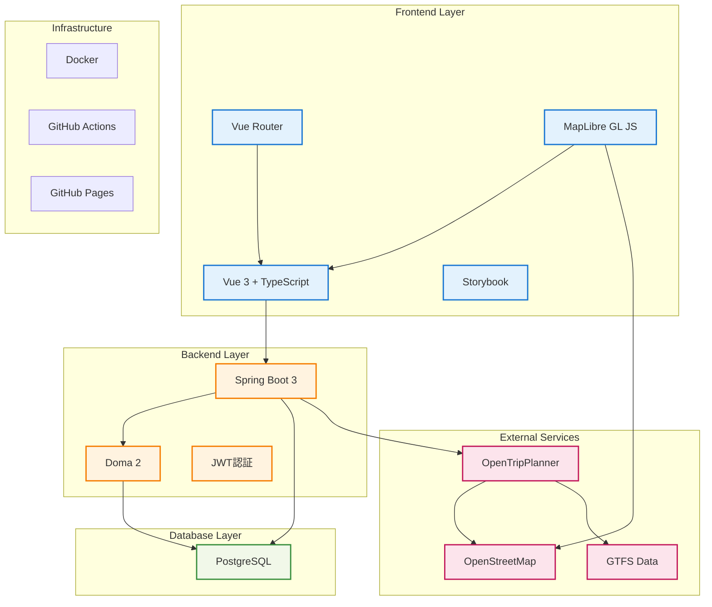

# 技術スタック

## アーキテクチャ概要



## フロントエンド

| 技術 | バージョン | 用途 |
|------|-----------|------|
| Vue.js | 3.x | UIフレームワーク |
| TypeScript | 6.x | 静的型付け |
| Vue Router | 4.x | SPAルーティング |
| Pinia | 2.x | 状態管理 |
| Axios | 1.x | HTTP通信クライアント |
| PrimeVue | 4.x | UIコンポーネントライブラリ |
| MapLibre GL JS | 5.x | 地図表示 |
| ESLint + Prettier | - | コード品質管理 |
| Jest | 30.x | ユニットテスト |
| Playwright | 1.x | E2Eテスト |
| Storybook | 8.6.14 | コンポーネント開発・ドキュメント |
| Vite | 8.x | ビルドツール |
| npm | - | パッケージ管理 |

## バックエンド

| 技術 | バージョン | 用途 |
|------|-----------|------|
| Java | 21.0.6 (LTS) | 言語 |
| Spring Boot | 3.3.5 | Webフレームワーク |
| Doma 2 | 2.60.0 | O/Rマッパー |
| jjwt | 0.12.6 | JWT認証 |
| springdoc-openapi | 2.6.0 | OpenAPI仕様書（Swagger UI / ReDoc） |
| Gradle | - | ビルドツール |

## データベース

| 技術 | バージョン | 用途 |
|------|-----------|------|
| PostgreSQL | 17.x（Neon） | リレーショナルDB |

## 外部サービス

| 技術 | バージョン | 用途 |
|------|-----------|------|
| OpenTripPlanner | 2.5.0 | GTFS経路探索 |
| OpenStreetMap | - | 地図データ |

## インフラ・ツール

| 技術 | バージョン | 用途 |
|------|-----------|------|
| Docker / Docker Compose | - | コンテナ化・開発環境統一 |
| GitHub Actions | - | CI/CD |
| Docsify | 4.13.1 | ドキュメントホスティング（ビルド不要） |
| GitHub Pages | - | ドキュメントホスティング |

## ホスティング・本番環境

| サービス | 用途 | URL |
|----------|------|-----|
| Vercel | フロントエンドホスティング | `https://www.kumamoto-henno-map.com` |
| Render | バックエンド（Spring Boot）ホスティング | `https://api.kumamoto-henno-map.com` |
| Neon | 本番データベース（PostgreSQL 17） | 外部接続（SSL必須） |
| Hetzner VPS | OpenTripPlannerサーバー（Nginx + SSL） | `https://otp.kumamoto-henno-map.com` |
| Cloudflare | ドメイン管理・DNS | `kumamoto-henno-map.com` |

### ドメイン構成

| サブドメイン | CNAME/A先 | 用途 |
|-------------|----------|------|
| `@` / `www` | Vercel | フロントエンド |
| `api` | Render（CNAME） | バックエンドAPI |
| `otp` | Hetzner VPS（Aレコード） | 経路探索エンジン |

### Vercel リライト設定

フロントエンドと同一オリジンからAPIを呼び出すため、Vercelのリライト機能でAPIプロキシを構成しています。

```
/kumamoto-henno-map/api/** → https://api.kumamoto-henno-map.com/kumamoto-henno-map/api/**
```

これにより Cookie（`SameSite=Lax`）が正常に送信され、クロスオリジン問題を回避しています。
