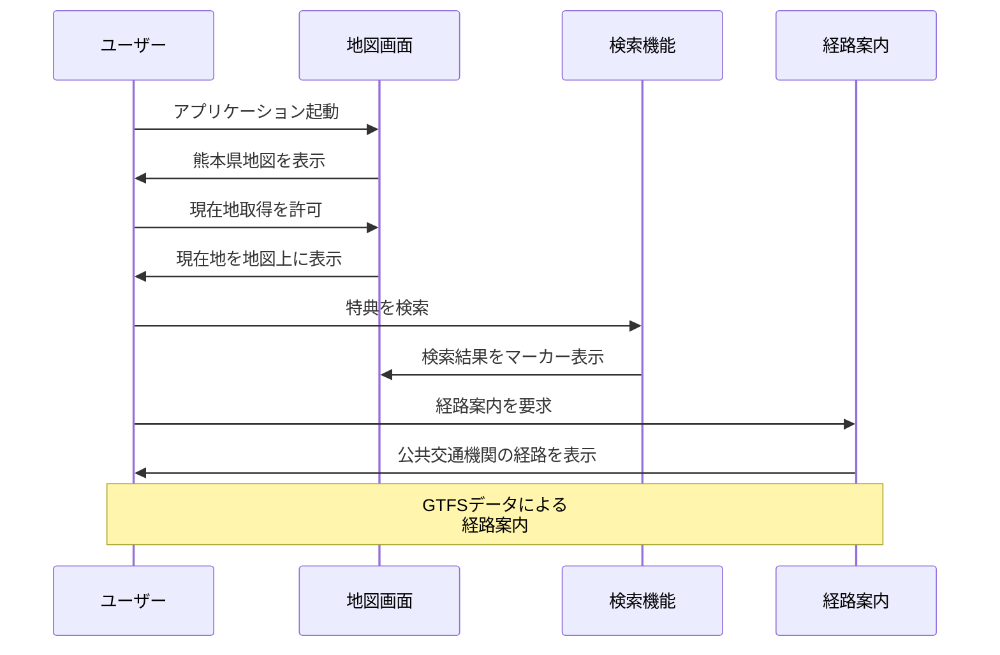

# 機能一覧

本システムで提供する全機能の一覧と詳細仕様を記載します。

## システム利用フロー

## 機能分類

### 1. 基本機能（エンドユーザー向け）

#### 1.1 地図表示・操作機能

| 機能ID | 機能名 | 概要 |
|--------|--------|------|
| F001 | 地図表示 | 熊本県の地図を表示し、特典提供施設をマーカーで表示 |
| F002 | 地図操作 | ズーム・パンなどの基本操作 |
| F003 | 現在地取得 | GPS情報による現在位置の取得と地図上での表示 |

#### 1.2 特典検索・絞り込み機能

| 機能ID | 機能名 | 概要 |
|--------|--------|------|
| F011 | キーワード検索 | 施設名・特典内容によるフリーワード検索 |
| F012 | カテゴリ絞り込み | 特典カテゴリ（交通・買い物等）による絞り込み |
| F013 | 地域絞り込み | 自治体・地区による絞り込み |
| F014 | 条件別絞り込み | 年齢・返納状況・居住地による絞り込み |

#### 1.3 特典情報表示機能

| 機能ID | 機能名 | 概要 |
|--------|--------|------|
| F021 | 特典詳細情報 | 特典の詳細内容・適用条件・有効期限の表示 |
| F022 | 施設情報表示 | 施設の基本情報・連絡先の表示 |

#### 1.4 経路案内機能

| 機能ID | 機能名 | 概要 |
|--------|--------|------|
| F031 | 公共交通経路探索 | GTFSデータを活用したバス・電車での経路案内 |
| F032 | 徒歩経路案内 | 最寄り駅・バス停からの徒歩ルート表示 |
| F033 | 所要時間・運賃表示 | 移動時間と交通費の計算・表示 |
| F035 | 複数経路比較 | 複数の経路候補の比較表示 |
| F036 | 乗り換え案内 | 詳細な乗り換え情報の提供 |

#### 1.5 ユーザー管理機能

| 機能ID | 機能名 | 概要 |
|--------|--------|------|
| F041 | 会員登録 | 新規ユーザーの会員登録 |
| F042 | ログイン・ログアウト | ユーザー認証とセッション管理 |
| F043 | プロフィール設定 | 年齢・居住地・返納状況の設定 |
| F044 | パスワード変更 | ログイン済みユーザーが現在のパスワードを確認した上で新パスワードに変更 |
| F045 | パスワードリセット | メールアドレスにリセット用URLを送信し、ワンタイムトークンで新パスワードを設定（トークン有効期限30分） |

#### 1.6 サポート・情報機能

| 機能ID | 機能名 | 概要 |
|--------|--------|------|
| F051 | ヘルプ・サポート情報 | 自主返納制度の説明と使い方ガイド |
| F061 | フィードバック送信 | ホーム画面のサイドバー下部「問い合わせ」ボタンからモーダルを開き、バグ報告・要望・その他のご意見をSlackに送信する |
| F062 | ライセンス・出典情報表示 | ホーム画面のサイドバー下部「ライセンス情報」ボタンからモーダルを開き、位置情報取得方針・OSSライセンス・オープンデータ出典を確認する |

### 2. 外部連携機能

#### 2.1 データ連携機能

| 機能ID | 機能名 | 概要 |
|--------|--------|------|
| E001 | GTFS連携 | 公共交通データとの連携 |
| E002 | OpenStreetMap連携 | 地図・道路データとの連携 |
| E003 | 自治体データ連携 | 各自治体の特典データ取り込み |

### 3. 管理機能（管理者向け）

管理者アカウントでログイン後に利用可能な機能。各管理機能は一覧表示・新規作成・更新・削除の基本CRUD操作と、CSVによる一括インポートを提供する。

#### 3.1 特典管理

| 機能ID | 機能名 | 概要 |
|--------|--------|------|
| A001-1 | 特典一覧表示 | キーワード・自治体・カテゴリ等で絞り込んだ特典の一覧をページング表示 |
| A001-2 | 特典新規作成 | 特典情報の新規登録 |
| A001-3 | 特典更新 | 登録済み特典情報の編集・保存 |
| A001-4 | 特典削除 | 特典の削除 |
| A001-5 | 特典CSVインポート | CSVファイルによる特典の一括登録・更新 |
| A001-6 | 特典座標取得 | AWS Location Serviceを使用して店舗特典（BS001）の店舗名から住所・緯度・経度を一括取得・保存 |

#### 3.2 特典条件管理

| 機能ID | 機能名 | 概要 |
|--------|--------|------|
| A002-1 | 特典条件一覧表示 | 特典ID・免許状況・年齢等で絞り込んだ利用条件の一覧をページング表示 |
| A002-2 | 特典条件新規作成 | 利用条件の新規登録 |
| A002-3 | 特典条件更新 | 登録済み利用条件の編集・保存 |
| A002-4 | 特典条件削除 | 利用条件の削除 |
| A002-5 | 特典条件CSVインポート | CSVファイルによる利用条件の一括登録・更新 |

#### 3.3 特典種別管理

| 機能ID | 機能名 | 概要 |
|--------|--------|------|
| A003-1 | 特典種別一覧表示 | カテゴリコード・名称等で絞り込んだ特典カテゴリの一覧をページング表示 |
| A003-2 | 特典種別新規作成 | 特典カテゴリの新規登録 |
| A003-3 | 特典種別更新 | 登録済みカテゴリの編集・保存 |
| A003-4 | 特典種別削除 | カテゴリの削除 |
| A003-5 | 特典種別CSVインポート | CSVファイルによるカテゴリの一括登録・更新 |

#### 3.4 自治体管理

| 機能ID | 機能名 | 概要 |
|--------|--------|------|
| A004-1 | 自治体一覧表示 | 自治体コード・名称・種別等で絞り込んだ自治体の一覧をページング表示 |
| A004-2 | 自治体新規作成 | 自治体情報の新規登録 |
| A004-3 | 自治体更新 | 登録済み自治体情報の編集・保存 |
| A004-4 | 自治体削除 | 自治体の削除 |
| A004-5 | 自治体CSVインポート | CSVファイルによる自治体の一括登録・更新 |

#### 3.5 事業者管理

| 機能ID | 機能名 | 概要 |
|--------|--------|------|
| A005-1 | 事業者一覧表示 | 事業者名・かな・電話番号等で絞り込んだ交通事業者の一覧をページング表示 |
| A005-2 | 事業者新規作成 | 交通事業者情報の新規登録 |
| A005-3 | 事業者更新 | 登録済み事業者情報の編集・保存 |
| A005-4 | 事業者削除 | 事業者の削除 |
| A005-5 | 事業者CSVインポート | CSVファイルによる事業者の一括登録・更新 |

#### 3.6 運賃割引管理

| 機能ID | 機能名 | 概要 |
|--------|--------|------|
| A006-1 | 運賃割引一覧表示 | 特典ID・事業者ID・割引種別等で絞り込んだ運賃割引の一覧をページング表示 |
| A006-2 | 運賃割引新規作成 | 運賃割引情報の新規登録 |
| A006-3 | 運賃割引更新 | 登録済み運賃割引情報の編集・保存 |
| A006-4 | 運賃割引削除 | 運賃割引の削除 |
| A006-5 | 運賃割引CSVインポート | CSVファイルによる運賃割引の一括登録・更新 |

#### 3.7 コミュニティバス路線管理

| 機能ID | 機能名 | 概要 |
|--------|--------|------|
| A007-1 | コミュニティバス路線一覧表示 | 路線名・路線ID等で絞り込んだコミュニティバス路線の一覧をページング表示 |
| A007-2 | コミュニティバス路線新規作成 | コミュニティバス路線情報の新規登録 |
| A007-3 | コミュニティバス路線更新 | 登録済み路線情報の編集・保存 |
| A007-4 | コミュニティバス路線削除 | コミュニティバス路線の削除 |
| A007-5 | コミュニティバス路線CSVインポート | CSVファイルによる路線の一括登録・更新 |

#### 3.8 ユーザー管理

| 機能ID | 機能名 | 概要 |
|--------|--------|------|
| A008-1 | ユーザー一覧表示 | ユーザー名・メール・自治体・免許状況等で絞り込んだユーザーの一覧をページング表示 |
| A008-2 | ユーザー詳細表示 | 特定ユーザーの詳細情報表示 |
| A008-3 | ユーザー更新 | ユーザー情報の編集・保存（管理者権限） |
| A008-4 | ユーザー削除 | ユーザーアカウントの削除 |

## 機能別詳細仕様

### F001: 地図表示

**概要**: 熊本県全域の地図を表示し、特典提供施設をマーカーで表示する基本機能

**詳細仕様**:
- **地図エンジン**: MapLibre GL JS
- **地図データ**: OpenStreetMap
- **初期表示範囲**: 熊本県全域（緯度経度：32.5-33.2, 130.2-131.2）
- **ズームレベル**: 8-18（県全域～建物レベル）
- **マーカー表示**: 特典カテゴリ別アイコン
- **店舗マーカー表示切替**: 地図右上のトグルスイッチ（`pi pi-shop` アイコン + 「店舗」ラベル）で、座標を持つ店舗特典（カテゴリ: BS001）のマーカー表示/非表示を切り替え可能
  - ON: `GET /benefit/markers` で座標付き店舗特典を全件取得しマーカー表示
  - OFF: 全ての店舗マーカーを削除
  - マーカークリック時: ポップアップで特典名・内容・電話番号・住所・詳細URLを表示
  - 検索結果との連動: 特典検索で座標付き結果がある場合、検索結果のマーカーを地図に表示
- **レスポンシブ対応**: スマートフォン・タブレット・PC対応

**入力**: なし
**出力**: 地図画面、特典マーカー
**前提条件**: インターネット接続
**例外処理**: 位置情報取得失敗時は熊本市中心部を表示

### F011: キーワード検索

**概要**: 施設名・特典内容によるフリーワード検索機能

**詳細仕様**:
- **検索対象フィールド**: 施設名、特典名、特典内容、住所
- **検索方式**: 部分一致（LIKE検索）
- **検索文字数**: 1文字以上50文字以内
- **検索結果**: 最大100件まで表示
- **ソート**: 関連度順、距離順、登録日順
- **ハイライト**: 検索キーワードのハイライト表示

**入力**: 検索キーワード（文字列）
**出力**: 検索結果リスト
**前提条件**: 1文字以上の入力
**例外処理**: 結果が0件の場合は「該当する特典が見つかりません」メッセージ表示

### F061: フィードバック送信

**概要**: ホーム画面のサイドバー下部にある「問い合わせ」ボタンからモーダルダイアログを開き、バグ報告・要望・その他のカテゴリで意見を送信する機能

**詳細仕様**:
- **アクセス**: ホーム画面のサイドバー下部「問い合わせ」ボタン（`pi pi-envelope` アイコン）
- **認証**: 不要（未ログインユーザーも送信可）
- **入力項目**:
  - カテゴリ（必須）: バグ報告 / 要望 / その他
  - お名前（任意）: ログイン済みの場合はユーザー名を初期値として自動入力
  - メールアドレス（任意）: ログイン済みの場合はメールアドレスを初期値として自動入力
  - 内容（必須）: 最大2000文字
- **送信先**: バックエンド経由でSlack Incoming Webhookに通知
- **Slack通知フォーマット**: カテゴリ・お名前・メールアドレス・内容・送信日時・ユーザー情報（ログイン済み/未ログイン）を含む
- **Webhook URL未設定時**: Slack送信をスキップしてサーバーログにのみ出力（サイレント処理）

**入力**: カテゴリ、お名前（任意）、メールアドレス（任意）、内容
**出力**: 送信完了メッセージ（モーダル内）
**前提条件**: 内容フィールドに1文字以上の入力
**例外処理**: Slack送信失敗時はモーダル内にエラーメッセージを表示

---

### F062: ライセンス・出典情報表示

**概要**: ホーム画面のサイドバー下部にある「ライセンス情報」ボタンからモーダルダイアログを開き、位置情報取得方針・OSSライセンス・オープンデータ出典を確認する機能

**詳細仕様**:
- **アクセス**: ホーム画面のサイドバー下部「ライセンス情報」ボタン（`pi pi-info-circle` アイコン）
- **表示内容**:
  - 位置情報の取得について（ルート計算のみに使用・サーバー保存なし）
  - 自主返納特典の出典（熊本県公式サイト）
  - OSS ライセンス情報（OpenTripPlanner 2.5.0 / Apache License 2.0 / GNU LGPL v3）
  - オープンデータ出典（バスきたくまさん CC BY 4.0、熊本市交通局 CC BY 2.1 JP、熊本電鉄 CC0 1.0）
- **リンク**: 関連URLはすべて新規タブで開く（`noopener,noreferrer`）

**入力**: なし
**出力**: モーダルダイアログ（スクロール可能）
**前提条件**: なし

---

### F031: 公共交通経路探索

**概要**: GTFSデータを活用した公共交通機関での経路案内

**詳細仕様**:
- **連携システム**: OpenTripPlanner 2.5.0
- **対応交通手段**: バス、電車、徒歩
- **経路計算**: 最短時間、最少乗り換え、最安運賃
- **時刻指定**: 出発時刻、到着時刻指定可能
- **結果表示**: 経路図、時刻表、運賃、乗り換え詳細
- **更新頻度**: GTFSデータは月次更新

**入力**: 出発地、目的地、時刻、経路オプション
**出力**: 経路候補リスト
**前提条件**: 有効な出発地・目的地の指定
**例外処理**: 経路が見つからない場合は代替手段の提案
