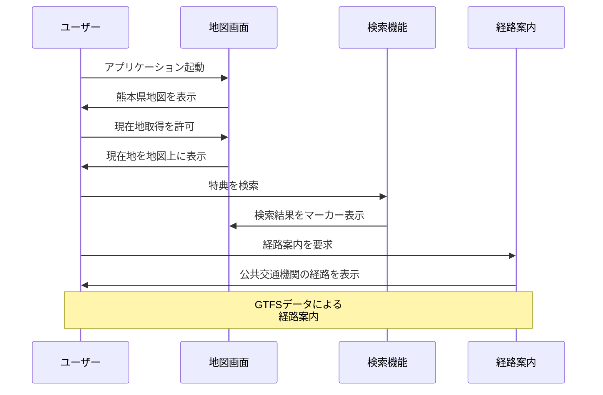

# 機能一覧

本システムで提供する全機能の一覧と詳細仕様を記載します。

## システム利用フロー

## 機能分類

### 1. 基本機能（エンドユーザー向け）

#### 1.1 地図表示・操作機能

| 機能ID | 機能名 | 概要 |
|--------|--------|------|
| F001 | 地図表示 | 熊本県の地図を表示し、特典提供施設をマーカーで表示 |
| F002 | 地図操作 | ズーム・パンなどの基本操作 |
| F003 | 現在地取得 | GPS情報による現在位置の取得と地図上での表示 |

#### 1.2 特典検索・絞り込み機能

| 機能ID | 機能名 | 概要 |
|--------|--------|------|
| F011 | キーワード検索 | 施設名・特典内容によるフリーワード検索 |
| F012 | カテゴリ絞り込み | 特典カテゴリ（交通・買い物等）による絞り込み |
| F013 | 地域絞り込み | 自治体・地区による絞り込み |
| F014 | 条件別絞り込み | 年齢・返納状況・居住地による絞り込み |

#### 1.3 特典情報表示機能

| 機能ID | 機能名 | 概要 |
|--------|--------|------|
| F021 | 特典詳細情報 | 特典の詳細内容・適用条件・有効期限の表示 |
| F022 | 施設情報表示 | 施設の基本情報・連絡先の表示 |

#### 1.4 経路案内機能

| 機能ID | 機能名 | 概要 |
|--------|--------|------|
| F031 | 公共交通経路探索 | GTFSデータを活用したバス・電車での経路案内 |
| F032 | 徒歩経路案内 | 最寄り駅・バス停からの徒歩ルート表示 |
| F033 | 所要時間・運賃表示 | 移動時間と交通費の計算・表示 |
| F035 | 複数経路比較 | 複数の経路候補の比較表示 |
| F036 | 乗り換え案内 | 詳細な乗り換え情報の提供 |

#### 1.5 ユーザー管理機能

| 機能ID | 機能名 | 概要 |
|--------|--------|------|
| F041 | 会員登録 | 新規ユーザーの会員登録 |
| F042 | ログイン・ログアウト | ユーザー認証とセッション管理 |
| F043 | プロフィール設定 | 年齢・居住地・返納状況の設定 |
| F044 | パスワード変更 | ログイン済みユーザーが現在のパスワードを確認した上で新パスワードに変更 |
| F045 | パスワードリセット | メールアドレスにリセット用URLを送信し、ワンタイムトークンで新パスワードを設定（トークン有効期限30分） |

#### 1.6 サポート・情報機能

| 機能ID | 機能名 | 概要 |
|--------|--------|------|
| F051 | ヘルプ・サポート情報 | 自主返納制度の説明と使い方ガイド |

### 2. 外部連携機能

#### 2.1 データ連携機能

| 機能ID | 機能名 | 概要 |
|--------|--------|------|
| E001 | GTFS連携 | 公共交通データとの連携 |
| E002 | OpenStreetMap連携 | 地図・道路データとの連携 |
| E003 | 自治体データ連携 | 各自治体の特典データ取り込み |

## 機能別詳細仕様

### F001: 地図表示

**概要**: 熊本県全域の地図を表示し、特典提供施設をマーカーで表示する基本機能

**詳細仕様**:
- **地図エンジン**: MapLibre GL JS
- **地図データ**: OpenStreetMap
- **初期表示範囲**: 熊本県全域（緯度経度：32.5-33.2, 130.2-131.2）
- **ズームレベル**: 8-18（県全域～建物レベル）
- **マーカー表示**: 特典カテゴリ別アイコン
- **レスポンシブ対応**: スマートフォン・タブレット・PC対応

**入力**: なし
**出力**: 地図画面、特典マーカー
**前提条件**: インターネット接続
**例外処理**: 位置情報取得失敗時は熊本市中心部を表示

### F011: キーワード検索

**概要**: 施設名・特典内容によるフリーワード検索機能

**詳細仕様**:
- **検索対象フィールド**: 施設名、特典名、特典内容、住所
- **検索方式**: 部分一致（LIKE検索）
- **検索文字数**: 1文字以上50文字以内
- **検索結果**: 最大100件まで表示
- **ソート**: 関連度順、距離順、登録日順
- **ハイライト**: 検索キーワードのハイライト表示

**入力**: 検索キーワード（文字列）
**出力**: 検索結果リスト
**前提条件**: 1文字以上の入力
**例外処理**: 結果が0件の場合は「該当する特典が見つかりません」メッセージ表示

### F031: 公共交通経路探索

**概要**: GTFSデータを活用した公共交通機関での経路案内

**詳細仕様**:
- **連携システム**: OpenTripPlanner 2.5.0
- **対応交通手段**: バス、電車、徒歩
- **経路計算**: 最短時間、最少乗り換え、最安運賃
- **時刻指定**: 出発時刻、到着時刻指定可能
- **結果表示**: 経路図、時刻表、運賃、乗り換え詳細
- **更新頻度**: GTFSデータは月次更新

**入力**: 出発地、目的地、時刻、経路オプション
**出力**: 経路候補リスト
**前提条件**: 有効な出発地・目的地の指定
**例外処理**: 経路が見つからない場合は代替手段の提案
