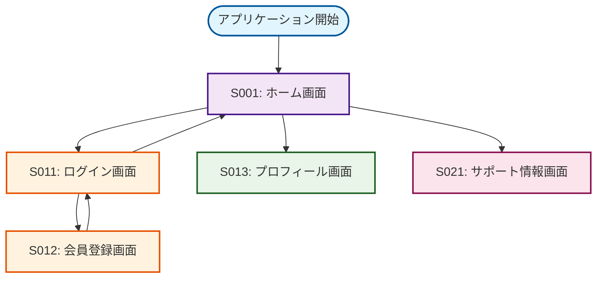
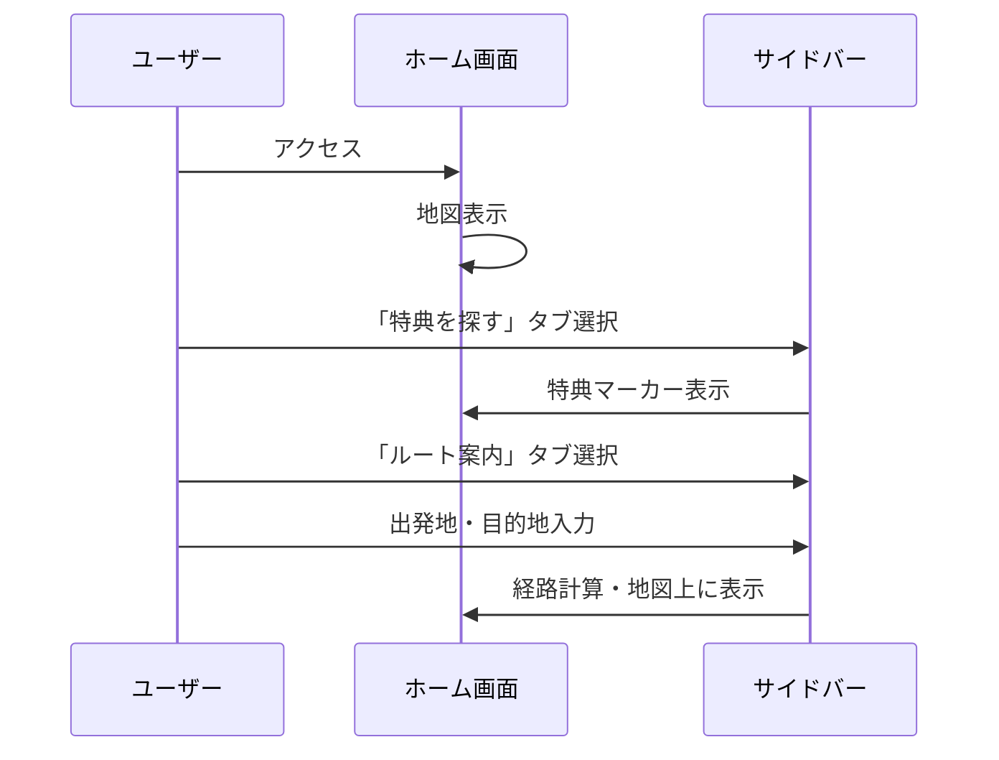
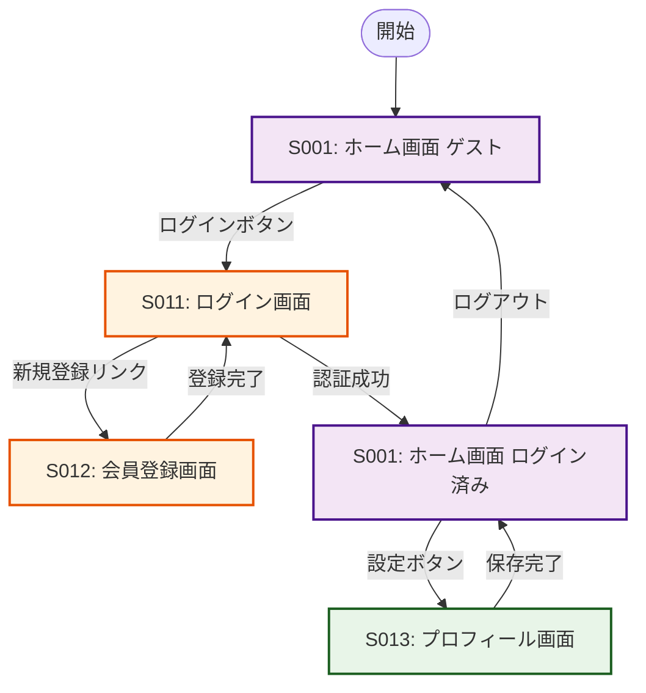

# 画面遷移図

本システムの画面間の遷移フローと操作の流れを図示します。

## 全体画面遷移図

## エンドユーザー向けフロー詳細

### 1. 基本利用フロー（未登録ユーザー）

### 2. 会員登録・ログインフロー

## 画面遷移の詳細仕様

### 遷移方法の種類

| 遷移方法 | 説明 | 実装方式 | 使用場面 |
|----------|------|----------|----------|
| ページ遷移 | 新しい画面に完全移行 | Vue Router | メイン機能間の移動 |
| モーダル表示 | 現在画面の上にオーバーレイ | Vue Modal | 確認ダイアログ、詳細表示 |
| サイドパネル | 画面の一部をスライド表示 | CSS Transform | 検索結果、メニュー |
| タブ切り替え | 同一画面内のコンテンツ変更 | Vue Tab Component | 設定項目、詳細情報 |

### 認証が必要な画面

**認証必要画面**:
- S013: プロフィール画面

**パブリック画面**:
- S001: ホーム画面（ゲスト利用可能）
- S011: ログイン画面
- S012: 会員登録画面
- S021: サポート情報画面
