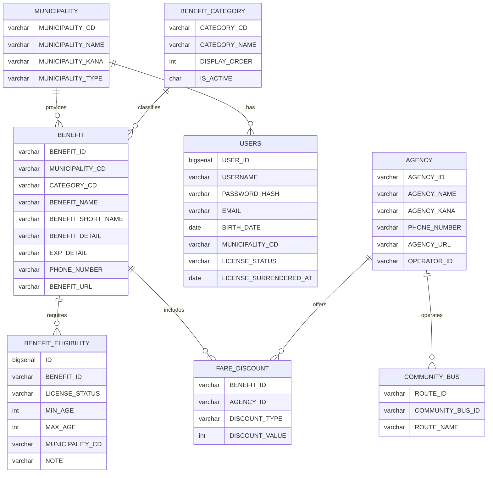

# ER図

本システムのデータベース設計におけるエンティティ関係図です。

> 全テーブル共通の `SYS_CREATED_AT`（作成日時）・`SYS_UPDATED_AT`（更新日時）は図から省略しています。

## ER図

---

## データ整合性制約

### 外部キー制約

| テーブル | 外部キー列 | 参照先 |
|----------|-----------|--------|
| BENEFIT | MUNICIPALITY_CD | MUNICIPALITY.MUNICIPALITY_CD |
| BENEFIT | CATEGORY_CD | BENEFIT_CATEGORY.CATEGORY_CD |
| BENEFIT_ELIGIBILITY | BENEFIT_ID | BENEFIT.BENEFIT_ID |
| USERS | MUNICIPALITY_CD | MUNICIPALITY.MUNICIPALITY_CD |
| COMMUNITY_BUS | COMMUNITY_BUS_ID | AGENCY.AGENCY_ID |
| FARE_DISCOUNT | BENEFIT_ID | BENEFIT.BENEFIT_ID |
| FARE_DISCOUNT | AGENCY_ID | AGENCY.AGENCY_ID |

### FARE_DISCOUNT の複合主キー

`BENEFIT_ID` と `AGENCY_ID` の組み合わせが主キー（複合 PK）。同一特典・同一事業者の割引情報は一意となる。

### USERS のユニーク制約

`USERNAME` に一意制約（`USERS_USERNAME_UNIQUE`）が設定されており、重複ユーザー名は登録不可。
