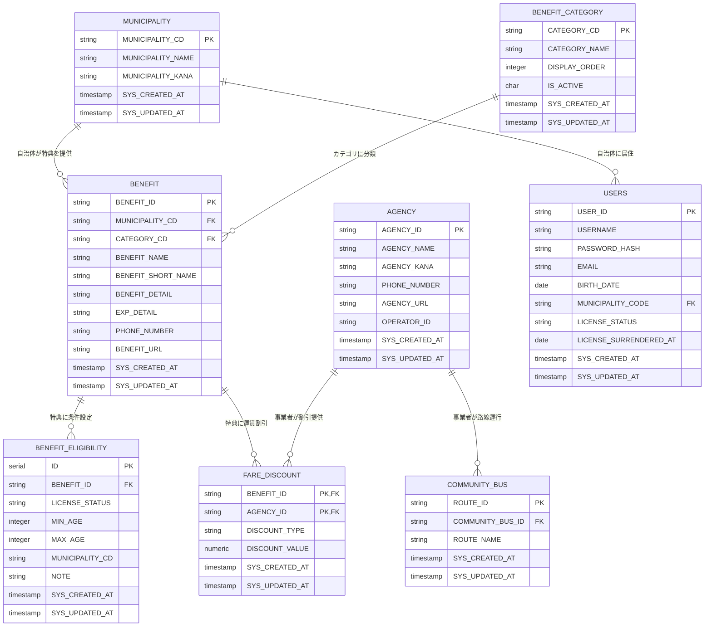

# ER図

本システムのデータベース設計におけるエンティティ関係図（Entity Relationship Diagram）を示します。

## エンティティ関係概要

## 主要な関係性

### 1. 特典管理の中心的関係

**BENEFIT（特典）**を中心とした関係性：

- `MUNICIPALITY` → `BENEFIT`：自治体が特典を提供（1対多）
- `BENEFIT_CATEGORY` → `BENEFIT`：カテゴリによる特典分類（1対多）
- `BENEFIT` → `BENEFIT_ELIGIBILITY`：特典ごとの適用条件設定（1対多）
- `BENEFIT` → `FARE_DISCOUNT`：特典ごとの運賃割引設定（1対多）

### 2. 事業者・運送関係

**AGENCY（事業者）**を起点とした関係性：

- `AGENCY` → `COMMUNITY_BUS`：事業者による路線運行（1対多）
- `AGENCY` → `FARE_DISCOUNT`：事業者による運賃割引提供（1対多）

### 3. ユーザー管理

**USERS（ユーザー）**と自治体の関係：

- `MUNICIPALITY` → `USERS`：自治体への居住（1対多）

## データ整合性制約

### 外部キー制約

1. **BENEFIT テーブル**
   - `MUNICIPALITY_CD` → `MUNICIPALITY.MUNICIPALITY_CD`
   - `CATEGORY_CD` → `BENEFIT_CATEGORY.CATEGORY_CD`

2. **BENEFIT_ELIGIBILITY テーブル**
   - `BENEFIT_ID` → `BENEFIT.BENEFIT_ID`

3. **USERS テーブル**
   - `MUNICIPALITY_CODE` → `MUNICIPALITY.MUNICIPALITY_CD`

4. **COMMUNITY_BUS テーブル**
   - `COMMUNITY_BUS_ID` → `AGENCY.AGENCY_ID`

5. **FARE_DISCOUNT テーブル**
   - `BENEFIT_ID` → `BENEFIT.BENEFIT_ID`
   - `AGENCY_ID` → `AGENCY.AGENCY_ID`

### ビジネスルール

1. **特典の自治体制約**：特典は必ず一つの自治体に属する
2. **特典のカテゴリ制約**：特典は必ず一つのカテゴリに属する
3. **運賃割引の制約**：運賃割引は特典と事業者の組み合わせで一意
4. **ユーザーの自治体制約**：ユーザーは最大一つの自治体に居住

## 正規化状況

本データベース設計は**第3正規形（3NF）**まで正規化されています：

- **第1正規形**：各属性が原子値を持つ
- **第2正規形**：部分関数従属を排除
- **第3正規形**：推移関数従属を排除

特に、特典情報（BENEFIT）から条件情報（BENEFIT_ELIGIBILITY）と運賃割引情報（FARE_DISCOUNT）を分離することで、データの重複を避け、保守性を向上させています。