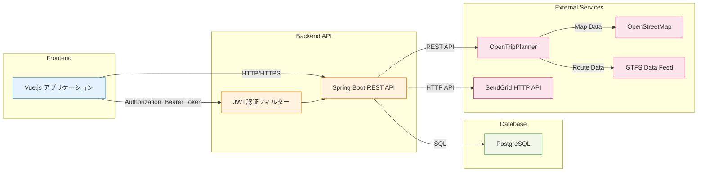
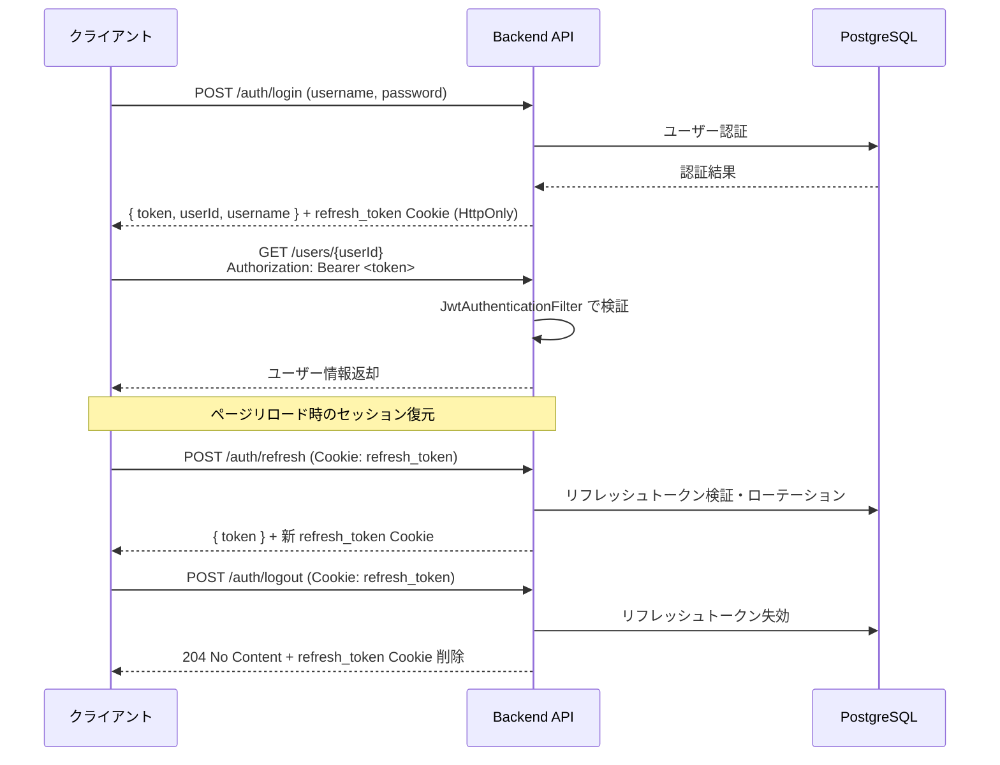

# API仕様

システムが提供する REST API の仕様です。

- ベース URL（本番・ブラウザ同一オリジン用 / www + リライト経由）: `https://www.kumamoto-henno-map.com/kumamoto-henno-map/api`
- ベース URL（本番・バックエンド直アクセス用 / api サブドメイン）: `https://api.kumamoto-henno-map.com/kumamoto-henno-map/api`
- ブラウザからフロントエンドと同一オリジンで利用する場合は `www` 側、API クライアント等から直接利用する場合は `api` 側を使用してください
- すべてのリクエストは `application/json`。ボディを持つレスポンスは `application/json`（204 No Content 等はボディなし）
- 認証が必要なエンドポイントは `Authorization: Bearer <token>` ヘッダーを付与する
- 通常の認証付き API は `Authorization` ヘッダーで Bearer Token を送信するため、Cookie 自動送信を前提とした CSRF の主対象ではない

> **OpenAPI 仕様書（ReDoc）** は GitHub Pages で公開されています。
> → [OpenAPI 仕様書（ReDoc）](https://taichi0373.github.io/kumamoto-henno-map/openapi/)
> → [openapi.yaml（ソース）](https://taichi0373.github.io/kumamoto-henno-map/openapi/openapi.yaml)

> **サービスクラス仕様書（Javadoc）** はコントローラーメソッドの引数・例外・内部処理の詳細を参照する場合に使用してください。
> → [サービスクラス仕様書（Javadoc）](https://taichi0373.github.io/kumamoto-henno-map/javadoc/)

---

## システム構成図



---

## 認証方式

JWT Bearer Token + リフレッシュトークン（HttpOnly Cookie）によるステートレス認証を採用しています。



**アクセストークン仕様**

| 項目 | 値 |
|---|---|
| 送信方式 | `Authorization: Bearer <token>` ヘッダー |
| 有効期限 | 1時間（3600秒） |
| フロントエンド保持 | Pinia state（メモリのみ・XSS耐性） |

**リフレッシュトークン Cookie 仕様**

| 属性 | 値 |
|---|---|
| 名前 | `refresh_token` |
| HttpOnly | `true`（JavaScript からアクセス不可） |
| Secure | `true`（本番）/ `false`（開発） |
| SameSite | `Lax` |
| Path | `${context-path}/auth` |
| Max-Age | 30日（2592000秒） |

---

## レスポンス共通形式

```json
{
  "success": true,
  "data": { ... },
  "message": null
}
```

| フィールド | 型 | 説明 |
|---|---|---|
| success | boolean | 処理成功時: `true`、エラー時: `false` |
| data | object / array / string / number / boolean / null | レスポンスデータ。データなしの場合も `null` として常に含まれる |
| message | string / null | エラー時のメッセージ。成功時は省略 |

---

## 1. 認証 (`/auth`)

### POST /auth/login

ログイン。認証成功時に JWT アクセストークンをレスポンスボディで返し、リフレッシュトークンを HttpOnly Cookie にセットする。

- **認証**: 不要

**リクエスト**

```json
{
  "username": "string",
  "password": "string"
}
```

**レスポンス 200 OK**

```json
{
  "success": true,
  "data": {
    "token": "eyJhbGciOiJIUzI1NiJ9...",
    "userId": 1,
    "username": "taro",
    "isAdmin": false
  }
}
```

> `refresh_token` は Set-Cookie ヘッダー（HttpOnly）で返却される。

**レスポンス 401 Unauthorized**

```json
{ "success": false, "data": null, "message": "ユーザー名またはパスワードが正しくありません" }
```

**レスポンス 429 Too Many Requests** — ログイン試行回数超過（15分後に解除）

```json
{ "success": false, "data": null, "message": "ログイン試行回数が上限を超えました。しばらく時間をおいて再度お試しください。" }
```

---

### POST /auth/refresh

リフレッシュトークンを使ってアクセストークンを再発行する。Cookie の `refresh_token` を使用し、ローテーションにより新しいリフレッシュトークンも発行する。

- **認証**: 不要（Cookie: `refresh_token` が必要）

**レスポンス 200 OK**

```json
{
  "success": true,
  "data": {
    "token": "eyJhbGciOiJIUzI1NiJ9...",
    "userInfo": {
      "userId": 1,
      "username": "taro",
      "isAdmin": false
    }
  }
}
```

> 新しい `refresh_token` が Set-Cookie ヘッダー（HttpOnly）で返却される。

**レスポンス 401 Unauthorized** — Cookie なし、または無効・失効済みトークン

---

### POST /auth/logout

ログアウト。DB 上のリフレッシュトークンを失効させ、Cookie を削除する。

- **認証**: 不要（Cookie: `refresh_token` があれば失効処理する）

**レスポンス 204 No Content**（ボディなし）

---

### POST /auth/password-reset/request

パスワードリセットメールを送信する。指定メールアドレスにリセット用トークンURLを送信する。メールアドレスの存在有無に関わらず同一レスポンスを返す（列挙攻撃対策）。

- **認証**: 不要

**リクエスト**

```json
{
  "email": "taro@example.com"
}
```

**レスポンス 200 OK**

```json
{
  "success": true,
  "data": null
}
```

**レスポンス 429 Too Many Requests** — リセット要求回数超過（15分後に解除）

```json
{ "success": false, "data": null, "message": "リセット要求回数が上限を超えました。しばらく時間をおいて再度お試しください。" }
```

---

### POST /auth/password-reset/confirm

リセットトークンを使ってパスワードを変更する。トークンは発行から30分間有効で、一度使用すると無効になる。

- **認証**: 不要

**リクエスト**

```json
{
  "token": "abc123...",
  "newPassword": "newPassword123",
  "confirmNewPassword": "newPassword123"
}
```

**レスポンス 200 OK**

```json
{ "success": true, "data": null }
```

**レスポンス 400 Bad Request** — 入力値不正（必須項目未入力・パスワード不一致・パスワード形式不正）

**レスポンス 429 Too Many Requests** — 試行回数超過（15分後に解除）

```json
{ "success": false, "data": null, "message": "試行回数が上限を超えました。しばらく時間をおいて再度お試しください。" }
```

---

## 2. ユーザー (`/users`)

### POST /users/signup

ユーザー登録（新規アカウント作成）。

- **認証**: 不要

**リクエスト**

```json
{
  "username": "string",
  "password": "string",
  "email": "string",
  "birthDate": "2000-01-01",
  "address": "43100",
  "licenseStatus": "2"
}
```

| フィールド | 型 | 必須 | 説明 |
|---|---|---|---|
| username | string | ○ | ユーザー名（一意・最大30文字） |
| password | string | ○ | パスワード（平文。サーバー側でハッシュ化） |
| email | string | ○ | メールアドレス（一意） |
| birthDate | string (ISO 8601) | - | 生年月日 |
| address | string | - | 居住自治体コード |
| licenseStatus | string | - | 運転免許の所持状況 |

**レスポンス 201 Created**

```json
{
  "success": true,
  "data": {
    "userId": 1,
    "username": "taro",
    "email": "taro@example.com",
    "birthDate": "2000-01-01",
    "address": "43100",
    "licenseStatus": "2",
    "licenseSurrenderedAt": null
  }
}
```

**レスポンス 409 Conflict** — ユーザー名またはメールアドレス重複

```json
{ "success": false, "data": null, "message": "このユーザー名は既に使用されています" }
```

```json
{ "success": false, "data": null, "message": "このメールアドレスは既に使用されています" }
```

**レスポンス 429 Too Many Requests** — 登録試行回数超過（1時間後に解除）

**レスポンス 503 Service Unavailable** — DB接続エラー

---

### GET /users/{userId}

ユーザー情報取得。認証されたユーザー自身のみアクセス可。

- **認証**: 必須（`Authorization: Bearer <token>`）

| パスパラメータ | 型 | 説明 |
|---|---|---|
| userId | Long | 取得対象ユーザーID |

**レスポンス 200 OK**

```json
{
  "success": true,
  "data": {
    "userId": 1,
    "username": "taro",
    "email": "taro@example.com",
    "birthDate": "2000-01-01",
    "address": "43100",
    "licenseStatus": "2",
    "licenseSurrenderedAt": "2024-04-01"
  }
}
```

**レスポンス 401 Unauthorized** — 未認証
**レスポンス 403 Forbidden** — 他ユーザーへのアクセス
**レスポンス 404 Not Found** — ユーザーが存在しない

---

### PUT /users

ユーザー情報更新。認証されたユーザー自身のみ更新可。

- **認証**: 必須（`Authorization: Bearer <token>`）

**リクエスト**

```json
{
  "userId": 1,
  "username": "taro",
  "email": "taro@example.com",
  "birthDate": "2000-01-01",
  "address": "43100",
  "licenseStatus": "2"
}
```

**レスポンス 200 OK**

```json
{ "success": true, "data": null }
```

**レスポンス 400 Bad Request** — バリデーションエラー（ユーザー名未入力・メールアドレス形式不正・生年月日不正）
**レスポンス 401 Unauthorized** — 未認証
**レスポンス 403 Forbidden** — 他ユーザーへのアクセス
**レスポンス 404 Not Found** — ユーザーが存在しない
**レスポンス 409 Conflict** — ユーザー名またはメールアドレス重複

```json
{ "success": false, "data": null, "message": "このユーザー名は既に使用されています" }
```

```json
{ "success": false, "data": null, "message": "このメールアドレスは既に使用されています" }
```

---

### PUT /users/password

パスワード変更。現在のパスワード確認後に新しいパスワードに変更する。

- **認証**: 必須（`Authorization: Bearer <token>`）

**リクエスト**

```json
{
  "currentPassword": "currentPass123",
  "newPassword": "newPass456",
  "confirmNewPassword": "newPass456"
}
```

**レスポンス 200 OK**

```json
{ "success": true, "data": null }
```

**レスポンス 400 Bad Request** — 入力値不正（必須項目未入力・パスワード不一致・パスワード形式不正）
**レスポンス 401 Unauthorized** — 未認証
**レスポンス 404 Not Found** — ユーザーが存在しない
**レスポンス 409 Conflict** — 現在のパスワードが正しくない

```json
{ "success": false, "data": null, "message": "現在のパスワードが正しくありません" }
```

---

## 3. 特典 (`/benefit`)

### GET /benefit/categories

有効な特典カテゴリ一覧を表示順で取得する。

- **認証**: 不要

**レスポンス 200 OK**

```json
{
  "success": true,
  "data": [
    {
      "categoryCd": "C001",
      "categoryName": "交通",
      "displayOrder": 1,
      "isActive": "1"
    }
  ]
}
```

---

### POST /benefit/search

検索条件（年齢・免許状態・自治体コード・キーワード等）から特典一覧を取得する。

- **認証**: 不要

**リクエスト**

```json
{
  "age": 70,
  "licenseStatus": "2",
  "municipalityCd": "43100",
  "keyword": "バス",
  "categoryCd": "C001"
}
```

| フィールド | 型 | 必須 | 説明 |
|---|---|---|---|
| age | Integer | - | 年齢 |
| licenseStatus | string | - | 運転免許の所持状況 |
| municipalityCd | string | - | 自治体コード |
| keyword | string | - | フリーワード検索 |
| categoryCd | string | - | カテゴリコード |

**レスポンス 200 OK**

```json
{
  "success": true,
  "data": [
    {
      "benefitId": "B001",
      "municipalityCd": "43100",
      "municipalityName": "熊本市",
      "municipalityKana": "くまもとし",
      "municipalityType": "市",
      "benefitName": "バス運賃割引",
      "benefitShortName": "バス割引",
      "benefitDetail": "バス運賃を10%割引",
      "expDetail": "2025年3月31日まで",
      "phoneNumber": "096-XXX-XXXX",
      "benefitUrl": "https://example.com/benefit",
      "categoryCd": "C001",
      "categoryName": "交通",
      "displayOrder": 1,
      "categoryIsActive": "1",
      "eligibilityId": 1,
      "licenseStatus": "2",
      "minAge": 65,
      "maxAge": null,
      "eligibilityMunicipalityCd": "43100",
      "eligibilityNote": null
    }
  ]
}
```

| フィールド | 説明 |
|---|---|
| benefitId | 特典ID |
| municipalityCd | 自治体コード |
| municipalityName | 自治体名称 |
| municipalityKana | 自治体名称かな |
| municipalityType | 自治体区分 |
| benefitName | 特典名称 |
| benefitShortName | 特典短縮名称 |
| benefitDetail | 特典内容 |
| expDetail | 有効期限 |
| phoneNumber | 問い合わせ電話番号 |
| benefitUrl | 特典URL |
| categoryCd | カテゴリコード |
| categoryName | カテゴリ名称 |
| displayOrder | 表示順 |
| categoryIsActive | カテゴリ有効フラグ（`"1"`: 有効） |
| eligibilityId | 利用条件ID |
| licenseStatus | 運転免許の所持状況 |
| minAge | 最低年齢 |
| maxAge | 最高年齢 |
| eligibilityMunicipalityCd | 利用条件の対象自治体コード |
| eligibilityNote | 備考 |

---

### GET /benefit/users/{userId}

ユーザーのプロフィール情報（年齢・免許状態・居住自治体）を元に、対象ユーザーが受けられる特典一覧を取得する。認証されたユーザー自身のみアクセス可。

- **認証**: 必須（`Authorization: Bearer <token>`）

| パスパラメータ | 型 | 説明 |
|---|---|---|
| userId | Long | 対象ユーザーID |

**レスポンス 200 OK** — `POST /benefit/search` と同形式の特典配列

**レスポンス 401 Unauthorized** — 未認証
**レスポンス 403 Forbidden** — 他ユーザーへのアクセス

---

## 4. 市区町村 (`/municipality`)

### GET /municipality/all

熊本県内の全市区町村情報を取得する。

- **認証**: 不要

**レスポンス 200 OK**

```json
{
  "success": true,
  "data": [
    {
      "municipalityCd": "43100",
      "municipalityName": "熊本市",
      "municipalityKana": "くまもとし",
      "municipalityType": "3"
    }
  ]
}
```

---

## 5. 経路探索 (`/route`)

### POST /route/search

出発地・目的地・日時を指定し、OpenTripPlanner (OTP) 経由で公共交通経路を探索する。未ログインでも利用可（ログイン時はユーザーIDがログに記録される）。

- **認証**: 任意（ログイン時はユーザーIDをログ記録）

**リクエスト**

```json
{
  "transportMode": "TRANSIT,WALK",
  "startLocation": "熊本駅",
  "startLat": 32.7898,
  "startLon": 130.6984,
  "endLocation": "熊本市役所",
  "endLat": 32.8031,
  "endLon": 130.7078,
  "date": "2025-04-01",
  "time": "09:00",
  "arriveBy": false
}
```

| フィールド | 型 | 必須 | 説明 |
|---|---|---|---|
| transportMode | string | ○ | OTP 交通手段指定（例: `"TRANSIT,WALK"`） |
| startLocation | string | - | 出発地名称（表示用） |
| startLat | Double | ○ | 出発地緯度 |
| startLon | Double | ○ | 出発地経度 |
| endLocation | string | - | 目的地名称（表示用） |
| endLat | Double | ○ | 目的地緯度 |
| endLon | Double | ○ | 目的地経度 |
| date | string (YYYY-MM-DD) | ○ | 出発日（または到着日） |
| time | string (HH:mm) | ○ | 出発時刻（または到着時刻） |
| arriveBy | boolean | - | `true`: 到着時刻指定、`false`: 出発時刻指定（デフォルト: `false`） |

**レスポンス 200 OK**

OTP から返却される経路情報をそのまま返す。`data` フィールドに OTP レスポンス（`plan.itineraries` 配列など）が格納される。

```json
{
  "success": true,
  "data": {
    "plan": {
      "itineraries": [
        {
          "duration": 1800,
          "legs": [ "..." ]
        }
      ]
    }
  }
}
```

**レスポンス 500 Internal Server Error** — OTP 接続エラーや経路探索失敗時

---

## 6. ヘルスチェック (`/health`)

### GET /health

サーバーの稼働確認用エンドポイント。Renderのスリープ対策として、GASから定期的にアクセスする用途で使用する。

- **認証**: 不要

**レスポンス 200 OK**（ボディ: `"OK"` テキスト）

---

## 7. 管理API (`/admin`)

管理者アカウントによるデータ管理用APIです。

### 認証

全管理APIは `Authorization: Bearer <token>` ヘッダーが必須です（管理者アカウントのJWTトークン）。

### ページングリクエスト共通パラメータ

一覧取得エンドポイント（`GET /admin/{resource}`）で共通して使用できるクエリパラメータ:

| パラメータ | 型 | デフォルト | 説明 |
|---|---|---|---|
| page | Integer | 0 | ページ番号（0始まり） |
| size | Integer | 20 | 1ページのサイズ |
| sort | String | - | ソート対象カラム名 |
| order | String | - | ソート方向（`asc` / `desc`） |
| keyword | String | - | 横断フリーワード検索 |

各エンドポイントには上記共通パラメータに加え、リソース固有の絞り込みパラメータが存在します。

### ページングレスポンス形式

```json
{
  "success": true,
  "data": {
    "content": [...],
    "totalElements": 100,
    "totalPages": 5,
    "page": 0,
    "size": 20
  }
}
```

### CSVインポートレスポンス形式

```json
{
  "success": true,
  "data": {
    "createdCount": 10,
    "updatedCount": 2,
    "failedCount": 1,
    "errors": ["行3: benefitIdが重複しています"]
  }
}
```

---

### GET /admin/agencies

交通事業者一覧をページング取得する。

- **認証**: 必須
- **固有パラメータ**: `agencyId`, `agencyName`, `agencyKana`, `phoneNumber`, `operatorId`

**レスポンス 200 OK** — ページングレスポンス形式（`content` に `AgencyEntity` の配列）

---

### GET /admin/agencies/all

セレクトボックス用に全事業者を一括取得する。

- **認証**: 必須

**レスポンス 200 OK**

```json
{
  "success": true,
  "data": [
    { "agencyId": "A001", "agencyName": "熊本バス", ... }
  ]
}
```

---

### POST /admin/agencies

事業者を新規作成する。

- **認証**: 必須

**リクエスト**: `AgencyEntity` 形式のJSONボディ

**レスポンス 200 OK** — 作成した `AgencyEntity`

---

### PUT /admin/agencies/{agencyId}

事業者情報を更新する。

- **認証**: 必須

| パスパラメータ | 型 | 説明 |
|---|---|---|
| agencyId | String | 更新対象の事業者ID |

**リクエスト**: `AgencyEntity` 形式のJSONボディ

**レスポンス 200 OK** — 更新後の `AgencyEntity`

---

### DELETE /admin/agencies/{agencyId}

事業者を削除する。

- **認証**: 必須

**レスポンス 200 OK**

---

### POST /admin/agencies/import

CSVファイルで事業者を一括登録・更新する。

- **認証**: 必須
- **リクエスト**: `multipart/form-data`（`file` パラメータ）

**レスポンス 200 OK** — CSVインポートレスポンス形式

---

### GET /admin/benefit-categories

特典カテゴリ一覧をページング取得する。

- **認証**: 必須
- **固有パラメータ**: `categoryCd`, `categoryName`, `displayOrder`

**レスポンス 200 OK** — ページングレスポンス形式（`content` に `BenefitCategoryEntity` の配列）

---

### POST /admin/benefit-categories

特典カテゴリを新規作成する。

- **認証**: 必須

**レスポンス 200 OK** — 作成した `BenefitCategoryEntity`

---

### PUT /admin/benefit-categories/{categoryCd}

特典カテゴリを更新する。

- **認証**: 必須

**レスポンス 200 OK** — 更新後の `BenefitCategoryEntity`

---

### DELETE /admin/benefit-categories/{categoryCd}

特典カテゴリを削除する。

- **認証**: 必須

**レスポンス 200 OK**

---

### POST /admin/benefit-categories/import

CSVファイルで特典カテゴリを一括登録・更新する。

- **認証**: 必須

**レスポンス 200 OK** — CSVインポートレスポンス形式

---

### GET /admin/benefits

特典一覧をページング取得する。

- **認証**: 必須
- **固有パラメータ**: `benefitId`, `benefitName`, `municipalityCd`, `categoryCd`, `expDetail`

**レスポンス 200 OK** — ページングレスポンス形式（`content` に `BenefitEntity` の配列）

---

### POST /admin/benefits

特典を新規作成する。

- **認証**: 必須

**レスポンス 200 OK** — 作成した `BenefitEntity`

---

### PUT /admin/benefits/{benefitId}

特典情報を更新する。

- **認証**: 必須

**レスポンス 200 OK** — 更新後の `BenefitEntity`

---

### DELETE /admin/benefits/{benefitId}

特典を削除する。

- **認証**: 必須

**レスポンス 200 OK**

---

### POST /admin/benefits/import

CSVファイルで特典を一括登録・更新する。

- **認証**: 必須

**レスポンス 200 OK** — CSVインポートレスポンス形式

---

### GET /admin/benefit-eligibilities

特典利用条件一覧をページング取得する。

- **認証**: 必須
- **固有パラメータ**: `id`, `benefitId`, `licenseStatus`, `minAge`, `maxAge`, `municipalityCd`

**レスポンス 200 OK** — ページングレスポンス形式（`content` に `BenefitEligibilityEntity` の配列）

---

### POST /admin/benefit-eligibilities

特典利用条件を新規作成する。

- **認証**: 必須

**レスポンス 200 OK** — 作成した `BenefitEligibilityEntity`

---

### PUT /admin/benefit-eligibilities/{id}

特典利用条件を更新する。

- **認証**: 必須

**レスポンス 200 OK** — 更新後の `BenefitEligibilityEntity`

---

### DELETE /admin/benefit-eligibilities/{id}

特典利用条件を削除する。

- **認証**: 必須

**レスポンス 200 OK**

---

### POST /admin/benefit-eligibilities/import

CSVファイルで特典利用条件を一括登録・更新する。

- **認証**: 必須

**レスポンス 200 OK** — CSVインポートレスポンス形式

---

### GET /admin/community-buses

コミュニティバス路線一覧をページング取得する。

- **認証**: 必須
- **固有パラメータ**: `routeId`, `routeName`, `communityBusId`

**レスポンス 200 OK** — ページングレスポンス形式（`content` に `CommunityBusEntity` の配列）

---

### POST /admin/community-buses

コミュニティバス路線を新規作成する。

- **認証**: 必須

**レスポンス 200 OK** — 作成した `CommunityBusEntity`

---

### PUT /admin/community-buses/{routeId}

コミュニティバス路線を更新する。

- **認証**: 必須

**レスポンス 200 OK** — 更新後の `CommunityBusEntity`

---

### DELETE /admin/community-buses/{routeId}

コミュニティバス路線を削除する。

- **認証**: 必須

**レスポンス 200 OK**

---

### POST /admin/community-buses/import

CSVファイルでコミュニティバス路線を一括登録・更新する。

- **認証**: 必須

**レスポンス 200 OK** — CSVインポートレスポンス形式

---

### GET /admin/fare-discounts

運賃割引一覧をページング取得する。

- **認証**: 必須
- **固有パラメータ**: `benefitId`, `agencyId`, `discountType`, `discountValue`

**レスポンス 200 OK** — ページングレスポンス形式（`content` に `FareDiscountEntity` の配列）

---

### POST /admin/fare-discounts

運賃割引を新規作成する。

- **認証**: 必須

**レスポンス 200 OK** — 作成した `FareDiscountEntity`

---

### PUT /admin/fare-discounts/{benefitId}/{agencyId}

運賃割引を更新する。複合主キー（`benefitId` + `agencyId`）を使用。

- **認証**: 必須

| パスパラメータ | 型 | 説明 |
|---|---|---|
| benefitId | String | 対象の特典ID |
| agencyId | String | 対象の事業者ID |

**レスポンス 200 OK** — 更新後の `FareDiscountEntity`

---

### DELETE /admin/fare-discounts/{benefitId}/{agencyId}

運賃割引を削除する。複合主キー（`benefitId` + `agencyId`）を使用。

- **認証**: 必須

**レスポンス 200 OK**

---

### POST /admin/fare-discounts/import

CSVファイルで運賃割引を一括登録・更新する。

- **認証**: 必須

**レスポンス 200 OK** — CSVインポートレスポンス形式

---

### GET /admin/municipalities

自治体一覧をページング取得する。

- **認証**: 必須
- **固有パラメータ**: `municipalityCd`, `municipalityName`, `municipalityKana`, `municipalityType`

**レスポンス 200 OK** — ページングレスポンス形式（`content` に `MunicipalityEntity` の配列）

---

### POST /admin/municipalities

自治体を新規作成する。

- **認証**: 必須

**レスポンス 200 OK** — 作成した `MunicipalityEntity`

---

### PUT /admin/municipalities/{municipalityCd}

自治体情報を更新する。

- **認証**: 必須

**レスポンス 200 OK** — 更新後の `MunicipalityEntity`

---

### DELETE /admin/municipalities/{municipalityCd}

自治体を削除する。

- **認証**: 必須

**レスポンス 200 OK**

---

### POST /admin/municipalities/import

CSVファイルで自治体を一括登録・更新する。

- **認証**: 必須

**レスポンス 200 OK** — CSVインポートレスポンス形式

---

### GET /admin/users

ユーザー一覧をページング取得する。

- **認証**: 必須
- **固有パラメータ**: `userId`, `username`, `email`, `birthDate`, `municipalityCd`, `licenseStatus`

**レスポンス 200 OK** — ページングレスポンス形式（`content` に `AdminUserResponseDto` の配列）

---

### GET /admin/users/{userId}

特定ユーザーの詳細情報を取得する。

- **認証**: 必須

| パスパラメータ | 型 | 説明 |
|---|---|---|
| userId | Long | 取得対象ユーザーID |

**レスポンス 200 OK**

```json
{
  "success": true,
  "data": {
    "userId": 1,
    "username": "taro",
    "email": "taro@example.com",
    "birthDate": "2000-01-01",
    "address": "43100",
    "licenseStatus": "2",
    "licenseSurrenderedAt": "2024-04-01"
  }
}
```

---

### PUT /admin/users/{userId}

ユーザー情報を管理者権限で更新する。

- **認証**: 必須

**リクエスト**: `UsersEntity` 形式のJSONボディ

**レスポンス 200 OK** — 更新後の `AdminUserResponseDto`

---

### DELETE /admin/users/{userId}

ユーザーアカウントを削除する。

- **認証**: 必須

**レスポンス 200 OK**

---

## エラーコード一覧

| HTTP ステータス | 主な原因 |
|---|---|
| 400 Bad Request | リクエストパラメータ不正、バリデーションエラー |
| 401 Unauthorized | Bearer Token なし、または無効・期限切れ |
| 403 Forbidden | 他ユーザーのリソースへのアクセス |
| 404 Not Found | 対象リソースが存在しない |
| 409 Conflict | ユーザー名・メールアドレスの重複登録、現在のパスワード不一致 |
| 429 Too Many Requests | レート制限超過（ログイン・登録・パスワードリセット） |
| 500 Internal Server Error | サーバー内部エラー、OTP 接続失敗 |
| 503 Service Unavailable | DB 接続エラー |
