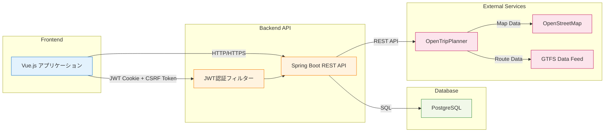
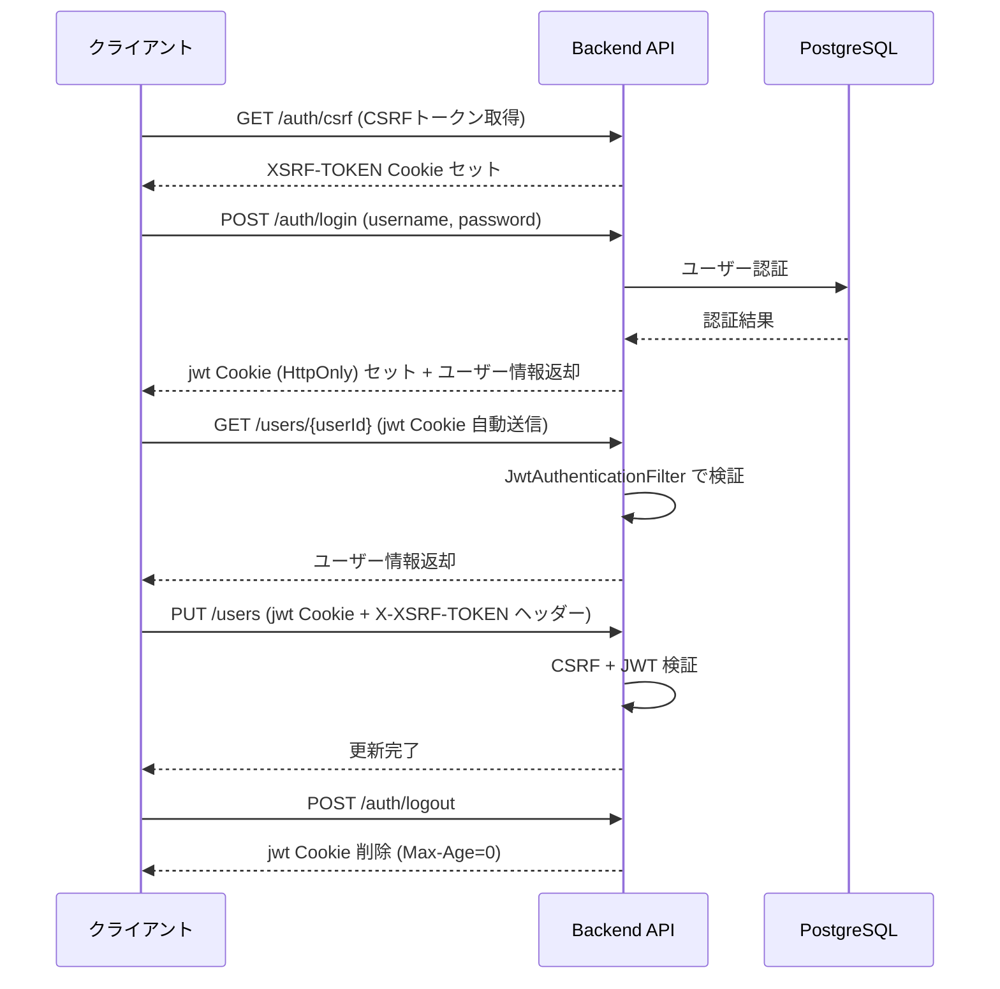

# API仕様

システムが提供する REST API の仕様です。

- ベース URL: `http://localhost:8081/benefit-map/api`
- すべてのリクエスト・レスポンスは `application/json`
- 認証が必要なエンドポイントは JWT を HttpOnly Cookie (`jwt`) で送信する
- 状態変更系（POST / PUT / DELETE）には CSRF トークン (`X-XSRF-TOKEN` ヘッダー) が必要（除外対象を除く）

> **OpenAPI 仕様書（ReDoc）** は GitHub Pages で公開されています。
> → [OpenAPI 仕様書（ReDoc）](https://taichi0373.github.io/benefit-map/openapi/)
> → [openapi.yaml（ソース）](openapi.yaml)

> **Swagger UI（インタラクティブな API ドキュメント）** はバックエンドを起動した状態でローカルでアクセスできます。
> → [Swagger UI（ローカルのみ）](http://localhost:8081/benefit-map/api/swagger-ui.html)
> → [OpenAPI JSON（ローカルのみ）](http://localhost:8081/benefit-map/api/v3/api-docs)

> **Javadoc（APIリファレンス）** はコントローラーメソッドの引数・例外・内部処理の詳細を参照する場合に使用してください。
> → [API仕様書（Javadoc）](https://taichi0373.github.io/benefit-map/javadoc/)

---

## システム構成図



---

## 認証方式

JWT (JSON Web Token) を HttpOnly Cookie で管理するステートレス認証を採用しています。



**JWT Cookie 仕様**

| 属性 | 値 |
|---|---|
| 名前 | `jwt` |
| HttpOnly | `true`（JavaScript からアクセス不可） |
| Secure | `true`（本番）/ `false`（開発） |
| SameSite | `Strict` |
| Path | `/benefit-map/api` |
| Max-Age | 3600 秒（1時間） |

**CSRF 保護**

| 項目 | 内容 |
|---|---|
| 方式 | `CookieCsrfTokenRepository` (Spring Security) |
| Cookie 名 | `XSRF-TOKEN`（JS から読み取り可） |
| ヘッダー名 | `X-XSRF-TOKEN` |
| 適用対象 | POST / PUT / DELETE（除外パスを除く） |
| CSRF 除外パス | `/auth/**`、`/users/signup` |

---

## レスポンス共通形式

```json
{
  "success": true,
  "data": { ... },
  "message": null
}
```

| フィールド | 型 | 説明 |
|---|---|---|
| success | boolean | 処理成功時: `true`、エラー時: `false` |
| data | object / array / string / number / boolean / null | 成功時のレスポンスデータ。`null` の場合は省略 |
| message | string / null | エラー時のメッセージ。成功時は省略 |

---

## 1. 認証 (`/auth`)

### POST /auth/login

ログイン。認証成功時に JWT を HttpOnly Cookie (`jwt`) にセットする。

- **認証**: 不要
- **CSRF**: 不要

**リクエスト**

```json
{
  "username": "string",
  "password": "string"
}
```

**レスポンス 200 OK**

```json
{
  "success": true,
  "data": {
    "userId": 1,
    "username": "taro"
  }
}
```

> JWT は `@JsonIgnore` により JSON に含まれない。Set-Cookie ヘッダーで返却される。

**レスポンス 401 Unauthorized**

```json
{ "success": false, "message": "ユーザー名またはパスワードが正しくありません" }
```

---

### POST /auth/logout

ログアウト。JWT Cookie を無効化（`Max-Age=0`）する。

- **認証**: 不要
- **CSRF**: 不要

**レスポンス 204 No Content**（ボディなし）

---

### GET /auth/csrf

CSRF トークンを取得する。フロントエンドは状態変更系 API を呼び出す前にこのエンドポイントを呼び出し、`X-XSRF-TOKEN` ヘッダーに使用する。レスポンスと同時に `XSRF-TOKEN` Cookie も設定される。

- **認証**: 不要
- **CSRF**: 不要

**レスポンス 200 OK**

```json
{
  "success": true,
  "data": "csrf-token-value"
}
```

---

## 2. ユーザー (`/users`)

### POST /users/signup

ユーザー登録（新規アカウント作成）。

- **認証**: 不要
- **CSRF**: 不要

**リクエスト**

```json
{
  "username": "string",
  "password": "string",
  "email": "string",
  "birthDate": "2000-01-01",
  "address": "string",
  "licenseStatus": "string"
}
```

| フィールド | 型 | 必須 | 説明 |
|---|---|---|---|
| username | string | ○ | ユーザー名（一意） |
| password | string | ○ | パスワード（平文。サーバー側でハッシュ化） |
| email | string | - | メールアドレス |
| birthDate | string (ISO 8601) | - | 生年月日 |
| address | string | - | 住所 |
| licenseStatus | string | - | 免許状態コード |

**レスポンス 201 Created**

```json
{
  "success": true,
  "data": {
    "userId": 1,
    "username": "taro",
    "email": "taro@example.com",
    "birthDate": "2000-01-01",
    "address": "熊本市中央区",
    "licenseStatus": "SURRENDERED",
    "licenseSurrenderedAt": null
  }
}
```

**レスポンス 409 Conflict** — ユーザー名重複

```json
{ "success": false, "message": "このユーザー名は既に使用されています" }
```

**レスポンス 503 Service Unavailable** — DB接続エラー

```json
{ "success": false, "message": "データベース接続エラーが発生しました。しばらく時間をおいて再度お試しください。" }
```

---

### GET /users/{userId}

ユーザー情報取得。JWT で認証されたユーザー自身のみアクセス可。

- **認証**: 必須（JWT Cookie）
- **CSRF**: 不要（GET）

| パスパラメータ | 型 | 説明 |
|---|---|---|
| userId | Long | 取得対象ユーザーID |

**レスポンス 200 OK**

```json
{
  "success": true,
  "data": {
    "userId": 1,
    "username": "taro",
    "email": "taro@example.com",
    "birthDate": "2000-01-01",
    "address": "熊本市中央区",
    "licenseStatus": "SURRENDERED",
    "licenseSurrenderedAt": "2024-04-01"
  }
}
```

**レスポンス 401 Unauthorized** — 未認証
**レスポンス 403 Forbidden** — 他ユーザーへのアクセス
**レスポンス 404 Not Found** — ユーザーが存在しない

---

### PUT /users

ユーザー情報更新。JWT で認証されたユーザー自身のみ更新可。

- **認証**: 必須（JWT Cookie）
- **CSRF**: 必須（`X-XSRF-TOKEN` ヘッダー）

**リクエスト**

```json
{
  "userId": 1,
  "username": "taro",
  "email": "taro@example.com",
  "birthDate": "2000-01-01",
  "address": "熊本市中央区",
  "licenseStatus": "SURRENDERED"
}
```

**レスポンス 200 OK**

```json
{ "success": true }
```

**レスポンス 401 Unauthorized** — 未認証
**レスポンス 403 Forbidden** — 他ユーザーへのアクセス
**レスポンス 404 Not Found** — ユーザーが存在しない

---

## 3. 特典 (`/benefit`)

### POST /benefit/search

検索条件（年齢・免許状態・自治体コード）から特典一覧を取得する。

- **認証**: 不要
- **CSRF**: 必須（`X-XSRF-TOKEN` ヘッダー）

**リクエスト**

```json
{
  "age": 70,
  "licenseStatus": "SURRENDERED",
  "municipalityCd": "43100"
}
```

| フィールド | 型 | 必須 | 説明 |
|---|---|---|---|
| age | Integer | - | 年齢 |
| licenseStatus | string | - | 免許状態コード |
| municipalityCd | string | - | 自治体コード |

**レスポンス 200 OK**

```json
{
  "success": true,
  "data": [
    {
      "benefitId": "B001",
      "municipalityCd": "43100",
      "municipalityName": "熊本市",
      "municipalityKana": "くまもとし",
      "municipalityType": "市",
      "benefitName": "バス運賃割引",
      "benefitShortName": "バス割引",
      "benefitDetail": "バス運賃を10%割引",
      "expDetail": "2025年3月31日まで",
      "phoneNumber": "096-XXX-XXXX",
      "benefitUrl": "https://example.com/benefit",
      "categoryCd": "C001",
      "categoryName": "交通",
      "displayOrder": 1,
      "categoryIsActive": "1",
      "eligibilityId": 1,
      "licenseStatus": "SURRENDERED",
      "minAge": 65,
      "maxAge": null,
      "eligibilityMunicipalityCd": "43100",
      "eligibilityNote": null
    }
  ]
}
```

| フィールド | 説明 |
|---|---|
| benefitId | 特典ID |
| municipalityCd | 自治体コード |
| municipalityName | 自治体名称 |
| municipalityKana | 自治体名称かな |
| municipalityType | 自治体区分 |
| benefitName | 特典名称 |
| benefitShortName | 特典短縮名称 |
| benefitDetail | 特典内容 |
| expDetail | 有効期限 |
| phoneNumber | 問い合わせ電話番号 |
| benefitUrl | 特典URL |
| categoryCd | カテゴリコード |
| categoryName | カテゴリ名称 |
| displayOrder | 表示順 |
| categoryIsActive | カテゴリ有効フラグ（`"1"`: 有効） |
| eligibilityId | 利用条件ID |
| licenseStatus | 免許状態コード |
| minAge | 最低年齢 |
| maxAge | 最高年齢 |
| eligibilityMunicipalityCd | 利用条件の対象自治体コード |
| eligibilityNote | 備考 |

---

### GET /benefit/users/{userId}

ユーザーのプロフィール情報（年齢・免許状態・居住自治体）を元に、対象ユーザーが受けられる特典一覧を取得する。JWT で認証されたユーザー自身のみアクセス可。

- **認証**: 必須（JWT Cookie）
- **CSRF**: 不要（GET）

| パスパラメータ | 型 | 説明 |
|---|---|---|
| userId | Long | 対象ユーザーID |

**レスポンス 200 OK** — `POST /benefit/search` と同形式の特典配列

**レスポンス 401 Unauthorized** — 未認証
**レスポンス 403 Forbidden** — 他ユーザーへのアクセス

---

## 4. 市区町村 (`/municipality`)

### GET /municipality/all

熊本県内の全市区町村情報を取得する。

- **認証**: 不要
- **CSRF**: 不要（GET）

**レスポンス 200 OK**

```json
{
  "success": true,
  "data": [
    {
      "municipalityCd": "43100",
      "municipalityName": "熊本市",
      "municipalityKana": "くまもとし",
      "municipalityType": "市"
    }
  ]
}
```

---

## 5. 経路探索 (`/route`)

### POST /route/search

出発地・目的地・日時を指定し、OpenTripPlanner (OTP) 経由で公共交通経路を探索する。未ログインでも利用可（ログイン時はユーザーIDがログに記録される）。

- **認証**: 任意（ログイン時はユーザーIDをログ記録）
- **CSRF**: 必須（`X-XSRF-TOKEN` ヘッダー）

**リクエスト**

```json
{
  "transportMode": "TRANSIT,WALK",
  "startLocation": "熊本駅",
  "startLat": 32.7898,
  "startLon": 130.6984,
  "endLocation": "熊本市役所",
  "endLat": 32.8031,
  "endLon": 130.7078,
  "date": "2025-04-01",
  "time": "09:00",
  "arriveBy": false
}
```

| フィールド | 型 | 必須 | 説明 |
|---|---|---|---|
| transportMode | string | ○ | OTP 交通手段指定（例: `"TRANSIT,WALK"`） |
| startLocation | string | - | 出発地名称（表示用） |
| startLat | Double | ○ | 出発地緯度 |
| startLon | Double | ○ | 出発地経度 |
| endLocation | string | - | 目的地名称（表示用） |
| endLat | Double | ○ | 目的地緯度 |
| endLon | Double | ○ | 目的地経度 |
| date | string (YYYY-MM-DD) | ○ | 出発日（または到着日） |
| time | string (HH:mm) | ○ | 出発時刻（または到着時刻） |
| arriveBy | boolean | - | `true`: 到着時刻指定、`false`: 出発時刻指定（デフォルト: `false`） |

**レスポンス 200 OK**

OTP から返却される経路情報をそのまま返す。`data` フィールドに OTP レスポンス（`plan.itineraries` 配列など）が格納される。

```json
{
  "success": true,
  "data": {
    "plan": {
      "itineraries": [
        {
          "duration": 1800,
          "legs": [ "..." ]
        }
      ]
    }
  }
}
```

**レスポンス 500 Internal Server Error** — OTP 接続エラーや経路探索失敗時

---

## エラーコード一覧

| HTTP ステータス | 主な原因 |
|---|---|
| 400 Bad Request | リクエストパラメータ不正 |
| 401 Unauthorized | JWT Cookie なし、または無効 |
| 403 Forbidden | 他ユーザーのリソースへのアクセス、CSRF トークン無効 |
| 404 Not Found | 対象リソースが存在しない |
| 409 Conflict | ユーザー名の重複登録 |
| 500 Internal Server Error | サーバー内部エラー、DB 接続失敗、OTP 接続失敗 |
| 503 Service Unavailable | DB 接続エラー（サインアップ時） |
